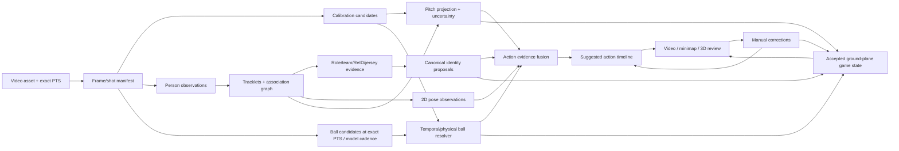

# Проект улучшения Replay Studio

Статус: proposal и проверяемый portfolio гипотез; не нормативный runtime
контракт.

Дата ревизии: 19 июля 2026.

Область: локальный некоммерческий редактор футбольных моментов длительностью
примерно 5–20 секунд; серверный GPU inference допустим.

Этот документ объединяет архитектуру приложения, хранение данных, качество
реконструкции, модели игроков и мяча, калибровку, идентификацию, позы, действия,
ручную проверку и будущую подготовку 3D-анимации. Детальные действующие контракты
остаются в [ARCHITECTURE.md](ARCHITECTURE.md),
[RECONSTRUCTION_QUALITY.md](RECONSTRUCTION_QUALITY.md),
[BALL_TRACKING.md](BALL_TRACKING.md),
[IDENTITY_RESOLUTION.md](IDENTITY_RESOLUTION.md),
[PLAYER_ACTIONS.md](PLAYER_ACTIONS.md) и
[TECHNICAL_DEBT.md](TECHNICAL_DEBT.md).

Нормативные архитектурные инварианты задаёт [ARCHITECTURE.md](ARCHITECTURE.md),
а активный приоритет реализации — [TECHNICAL_DEBT.md](TECHNICAL_DEBT.md). После
согласования решения из этого proposal переносятся туда отдельными clean-cut
изменениями. Сам документ не создаёт третий source of truth.

## 1. Краткое решение

Целевой результат — не правдоподобная картинка любой ценой, а проверяемый
`ground-plane game state`: наблюдаемые игроки и мяч, их связь во времени,
координаты на поле с неопределённостью, личности и действия с сохранённым
evidence. Поза и высота добавляются отдельными гипотезами и не превращают
монокулярное broadcast-видео в измеренную полную 3D-сцену.

Основное техническое решение:

1. PostgreSQL остаётся компактным control plane. Кадры, crops, dense detections,
   pose series и model evidence хранятся как immutable artifacts.
2. Один reconstruction run фиксирует video revision, модель, checkpoint,
   конфигурацию и зависимости каждой стадии. Изменившаяся стадия пересчитывает
   только зависящие от неё артефакты.
3. Для каждой capability существует provider-neutral контракт и несколько
   сравнимых providers: быстрый, основной и quality/challenger. Скрытой смены
   backend или silent fallback нет.
4. Надёжность достигается не одной «безотказной» моделью, а каскадом моделей,
   temporal reasoning, физическими ограничениями, состоянием `unknown` и
   авторитетными ручными исправлениями.
5. Распознавание действий строится снизу вверх: сначала траектории и контакты,
   затем 2D-поза, затем player-centric RGB/pose/context модель. Автоматический
   вывод всегда создаёт suggestion, а не подтверждённый факт.
6. Ни одна новая модель не становится default по красивому demo или self-
   reported score. Нужны одинаковые входные данные, сохранённые результаты,
   performance profile и проверка на нашем наборе сложных сцен.

## 2. Цели и честные границы

### 2.1 Цели

- устойчиво находить всех видимых участников, включая вратаря и судью;
- сохранять identity через краткие перекрытия, выходы из кадра и смену ракурса;
- восстанавливать положение на поле только при проверенной калибровке;
- находить маленький, размытый и кратковременно скрытый мяч без недоказанного
  temporal undersampling, сохраняя exact source PTS;
- предлагать номер и реальную личность игрока с возможностью отказа от ответа;
- извлекать 2D-позу и, где это оправдано, нормализованную 3D-позу;
- предлагать действия, actor и значимые фазы действия на player timeline;
- давать пользователю понять, что измерено, что интерполировано, что предложено
  моделью и что подтверждено вручную;
- сохранять воспроизводимость, приемлемый runtime и ограниченный рост диска.

### 2.2 Не-цели текущего этапа

- придумывать точное положение игрока вне всех камер;
- считать bottom-centre bbox точной точкой стоп при прыжке, подкате или
  перекрытии;
- считать homography плоскости поля достаточной для высоты летящего мяча;
- автоматически привязывать имя по одному OCR-чтению;
- автоматически запускать анализ при открытии проекта, refresh Match или
  переключении route;
- сохранять legacy-пути, dual writes и embedded dense payload ради старых
  локальных данных;
- запускать UCS-анимацию по неподтверждённой action hypothesis.

### 2.3 Общие оси достоверности, capability-specific DTO

Нельзя вводить один generic enum для calibration, pose, action и ball. Он смешал
бы происхождение, visibility, lifecycle, availability и QA. Каждая capability
сохраняет свой строгий контракт, но использует согласованные семантические оси:

| Ось | Примерные значения | Вопрос |
| --- | --- | --- |
| `origin` | `model`, `temporal`, `manual` | Откуда появилось evidence? |
| `visibility` | `visible`, `occluded`, `out-of-frame`, `unknown` | Был ли объект наблюдаем? |
| `decision` | `proposed`, `accepted`, `rejected` | Каково review-решение? |
| `availability` | `available`, `unavailable`, `failed` | Может ли capability дать результат? |
| `qualityVerdict` | `pass`, `review`, `reject` | Прошёл ли результат QA? |

Например, manual correction может подтверждать observed detection; action может
быть `origin=manual, decision=accepted`; pose joint — `visibility=occluded` при
доступном pose artifact. Интерполяция никогда не маскируется под observation.
Игрок может сохранять identity на timeline, но скрытая координата имеет
`origin=temporal`, растущую covariance или отсутствует.

## 3. Текущая база, которую сохраняем

| Область | Реализованная база | Что ещё не доказано |
| --- | --- | --- |
| Project/Match | Нормализованные проекты, assets, segments, canonical Match snapshot и provider mappings | Полнота внешних providers и сквозные multi-project E2E |
| Jobs | Durable queue, leases, fencing, cancellation, last-good publication | PostgreSQL concurrency lane и полная phase history |
| Storage | Dense reconstruction вынесена из Scene/PostgreSQL в artifacts; локальная файловая система — текущий canonical backend | GC, quotas и export/import; object store сознательно отложен до доказанной multi-host потребности |
| Calibration | PnLCalib worker, local keypoints, temporal propagation, manual anchors, QA overlay | Точность на partial pitch, extreme zoom и разных типах камер |
| People | Person detections, tracks, team/role evidence, manual confirm/exclude/merge/split | Измеренная recall/association точность на реальном наборе |
| Identity | Canonical people, ReID/OCR contracts, roster resolver и abstention | Выбор новой jersey-модели и реальная wrong-ID rate |
| Ball | Dedicated detector, temporal resolver, WASB challenger и manual keypoints | Exact-PTS/cadence accuracy, airborne state и hard-negative устойчивость |
| Actions | Ручные интервалы, семантические keypoints и timeline | Автоматические suggestions, review и pose artifacts |
| 3D | Ground-plane view, selected-object path, ручная траектория мяча | Pose-driven body, ball height и UCS animation integration |
| Quality | Runtime QA и versioned benchmark schemas/evaluator | Размеченный frozen product set и принятый baseline |

Факт наличия worker, health endpoint или синтетического теста означает только
исправность интеграции, но не качество модели.

## 4. Целевая архитектура



### 4.1 Control plane и data plane

PostgreSQL хранит:

- projects, canonical matches, snapshots и provider references;
- video assets, segments, compositions и ownership;
- compact scenes/read models, revisions и current accepted run;
- jobs, attempts, leases, cancellation и phase telemetry;
- canonical people, manual corrections, action intervals и keypoints;
- artifact manifests, SHA-256, schema/model versions и compact QA summaries.

Durable artifact plane хранит:

- source video generations и frame manifests;
- calibration candidates/solutions;
- raw person/ball observations, tracklets и association edges;
- embeddings, OCR evidence, pose series и action hypotheses;
- overlays, benchmark predictions и reports.

Decoded frames и большинство crops — reconstructible evictable cache, а не
обязательно durable evidence. Review crop либо детерминированно строится из
`source + PTS + geometry`, либо явно pin-ится manifest. Blob store владеет
immutable `put/get`; reachability/index/GC принадлежат lifecycle capability.

Логические контракты артефактов важнее конкретного формата. Табличные dense
series следует benchmark-нуть в Arrow/Parquet или компактном binary/JSONL;
изображения — отдельными JPEG/WebP objects. Выбор формата принимается по размеру,
windowed read latency и простоте воспроизведения, а не по моде.

### 4.2 Стадии и selective invalidation

| Артефакт | Зависит от | Не должен зависеть от |
| --- | --- | --- |
| Frame manifest | video SHA, PTS decoder config | detector/model selection |
| Calibration candidates | frame pixels, calibration model/config | manual anchors, roster, OCR |
| Resolved calibration | candidates, temporal graph, manual anchors | roster, OCR |
| Person observations | frame pixels, person model/config | calibration acceptance, identity |
| Raw tracklets | observations, tracker/ReID config | manual merge/split/exclude, jersey name binding |
| Corrected track graph | raw tracklets, manual merge/split/exclude | roster display name |
| Pose observations | crop pixels, crop transform, pose model/config | accepted roster identity |
| Jersey evidence | selected crops, OCR/JNR model/config | forced roster answer |
| Pitch person observations | corrected track/contact point, resolved calibration | action labels |
| Image-space ball candidates | frame pixels, ball model/config | calibration, manual points, jersey OCR |
| Resolved image-space ball path | candidates, temporal resolver/config, image-space manual points | calibration, jersey OCR |
| Pitch/height ball projection | resolved image path, resolved calibration, pitch/height manual points | jersey OCR |
| Tracklet action logits | relevant visual tracklets, pose/ball/context artifacts | real-player display name |
| Canonical actor projection | action logits, identity links/revision | unrelated project/scene data |

Fingerprint включает точные input hashes, schema version, model/checkpoint hash,
pre/post-processing config и manual evidence revision. Cache hit при неполном
fingerprint хуже cache miss: он тихо публикует устаревшую истину.

### 4.3 Capability и возможные process boundaries

Provider-neutral capability не означает обязательный HTTP-микросервис. Реализация
может быть local inference, supervised subprocess или remote worker; отдельный
процесс выбирается только из-за зависимостей, GPU lifecycle, scaling или failure
isolation.

| Capability/компонент | Ответственность | Граница |
| --- | --- | --- |
| API | HTTP, DTO, project ownership scoping, application commands | Не грузит CV-модели и не выполняет background work |
| Reconstruction runner | Typed phase composition, claim/lease, dependency checks, atomic publish | Не становится generic DAG scheduler; единственный владелец run lifecycle |
| Calibration worker | Keypoint/line segmentation и camera solve | Особые зависимости и GPU/CPU profile |
| Person capability | Detector/optional segmentation, strict observation output | Local/subprocess/remote provider; batch inference |
| Identity worker | Embeddings/ReID | Своя модель, cache и privacy boundary |
| Jersey worker | Tracklet-level legibility/JNR/OCR | Не должен быть частью общего person detector |
| Ball capability | Exact-PTS temporal model | Другая cadence/логика, чем у людей; optional remote worker |
| Pose capability | Bounded tracklet crops → 2D/optional 3D joints | Тяжёлый optional downstream; worker только при необходимости |
| Action capability | Evidence fusion → suggestions | Может начаться local rules; worker нужен learned model позже |
| Blob store | Immutable put/get | Не знает reconstruction windows/GC policy |
| Artifact lifecycle/catalog | Ownership, reachability, bounded retrieval, GC | Отдельно от low-level blob I/O |

Не нужно создавать микросервис для каждого Python-класса. Отдельный процесс
оправдан различием зависимостей, GPU-профиля, масштабирования или failure domain.
Избыточное дробление добавит network copies, version skew и сложную отладку.

### 4.4 Профили анализа

| Профиль | Назначение | Политика |
| --- | --- | --- |
| `dev-fast` | Быстрая локальная проверка UI/контрактов | Лёгкие models, sparse people, без 3D pose и learned actions |
| `balanced` | Обычный анализ highlight | Domain detector, full tracking, dense ball, selected-crop jersey/pose |
| `quality` | Финальный offline pass на GPU server | Quality detector, bidirectional association, challengers и ambiguous-case escalation |

Профиль — immutable часть run input. UI может предложить профиль, но не должен
незаметно понижать quality при недоступном worker. Недоступность отражается как
явный `unavailable`/`failed dependency` или как подтверждённый пользователем
новый run с другим профилем.

## 5. Общие архитектурные гипотезы

### H-FND-01 — небольшой внутренний gold set раньше смены default-моделей

**Гипотеза.** Разметить разнообразные кадры, tracklets, ball intervals и action
instances из наших видео и сравнивать все providers на одном frozen наборе.

**Что даст.** Отделит улучшение конкретного скрина от улучшения продукта;
покажет регрессии на дальних игроках, вратарях, partial pitch и перекрытиях.

**Плюсы.** Воспроизводимый выбор; честные strata; возможность сохранять
worst-N overlays; основа для confidence calibration.

**Минусы и side effects.** Требует ручной разметки и второго review; маленький
набор может переобучить наши решения на один матч; labels тоже ошибаются.

**Сомнение.** Внешний SoccerNet benchmark сейчас отложен решением владельца.
Это не мешает небольшому внутреннему product set. Если остаётся только
визуальная приёмка, provider может существовать под experimental flag, но
утверждать рост accuracy и делать его безусловным default нельзя.

**Проверка.** Split по матчам/shots, а не соседним кадрам; video SHA и annotation
revision; минимум два reviewer для части test; отдельные метрики по strata.

### H-FND-02 — capability-specific catalog/factory вместо model service locator

**Гипотеза.** Каждая capability имеет versioned DTO, собственный immutable model
catalog/factory и явный provider selection в run profile. Единого mutable
global registry/service locator нет.

**Что даст.** A/B без переписывания reconstruction, быстрый rollback и
server/local варианты одной capability.

**Плюсы.** Изоляция лицензий и зависимостей; model provenance; тестируемые
контракты; возможность shadow run.

**Минусы и side effects.** Больше DTO и compatibility work между schema
versions; слишком общий контракт может скрыть уникальные возможности модели.

**Решение.** Общий контракт содержит минимальную семантику и explicit optional
capabilities; breaking contract получает новую версию. Legacy route удаляется
в том же cutover.

### H-FND-03 — каскад fast → quality только для неоднозначных случаев

**Гипотеза.** Лёгкий provider обрабатывает весь клип, тяжёлый получает только
low-confidence tracklets/crops или выбранный пользователем объект.

**Что даст.** Большая часть accuracy дорогой модели при существенно меньшем
runtime и VRAM pressure.

**Плюсы.** Хорошо подходит jersey OCR, segmentation, pose и VLM; позволяет
progressive results.

**Минусы и side effects.** Ошибка fast gate может не отправить действительно
сложный случай на quality; две модели дают несопоставимые confidence.

**Проверка.** Coverage-vs-quality curve, false-negative escalation rate,
calibrated per-provider scores и hard upper bound на escalated items.

### H-FND-04 — decode once и immutable crop/frame cache

**Гипотеза.** Один точный FrameManifest и content-addressed frame/crop cache
используются всеми стадиями.

**Что даст.** Уберёт повторный ffmpeg decode и несовпадение PTS между ball,
people, OCR и pose.

**Плюсы.** Быстрый rerun downstream; точные fingerprints; меньше CPU/I/O.

**Минусы и side effects.** Cache занимает диск, требует GC и защиты от partial
writes; pre-extract всех кадров может быть дороже on-demand decode.

**Решение.** Manifest создаётся всегда; pixels кэшируются лениво и bounded,
high-cadence ball windows — отдельно; mark-and-sweep учитывает accepted и
in-flight manifests.

### H-FND-05 — offline forward/backward reasoning

**Гипотеза.** Поскольку анализируется сохранённый highlight, использовать
будущие кадры для reconciliation треков, мяча, калибровки и pose smoothing.

**Что даст.** Восстановление коротких пропусков до повторного появления и более
стабильные identity/action intervals.

**Плюсы.** Нет требования live latency; можно сравнить несколько гипотез целиком.

**Минусы и side effects.** Увеличивает latency; smoothing способен провести
объект через неверное место или через camera cut.

**Решение.** Cut/replay — жёсткий barrier; inferred interval хранит uncertainty;
дальние gaps не заполняются точными координатами.

## 6. База данных, artifacts и эксплуатация

### H-DATA-01 — PostgreSQL только как компактный control plane

**Статус:** принято и в основном реализовано.

**Плюсы.** Job polling не гоняет мегабайты Scene JSON; транзакционные leases,
CAS и ownership остаются сильной стороной PostgreSQL; UI быстро получает lists
и progress.

**Минусы.** Для просмотра dense evidence нужен дополнительный artifact request;
атомарность DB + artifact blob store требует publish protocol.

**Негативный side effect при нарушении.** Возврат frame series в Scene снова
сделает polling пропорциональным видео и воспроизведёт десятки гигабайт idle
traffic, уже зафиксированные в [PERFORMANCE.md](PERFORMANCE.md).

**Инвариант.** Сначала immutable object полностью записан и checksum-verified,
затем fenced transaction публикует manifest/current run.

### H-DATA-02 — stage-oriented artifacts вместо одного giant result

**Гипотеза.** Calibration, detections, tracks, pose, OCR, ball и actions имеют
отдельные versioned manifests.

**Что даст.** Замена tracker не перезапускает decode/detection; смена jersey
модели не трогает calibration и ball.

**Плюсы.** Дешёвые эксперименты, provenance, воспроизведение ошибок.

**Минусы и side effects.** Больше объектов и dependency graph; orphan artifacts
без GC; опасность несовместимых schema.

**Проверка.** Contract tests, dependency hashes, reachability GC dry-run,
per-project quota и corrupt-artifact fail-closed.

**Clean-cut переход.** Новый набор stage manifests получает единый schema bump.
В том же изменении все first-party consumers переводятся на новые keys, старые
manifest keys и hydration path удаляются. Dual write/read и бессрочный
compatibility fallback не допускаются.

### H-DATA-03 — normalized multi-project и provider-neutral Match

**Статус:** архитектурная база реализована; E2E и provider completeness остаются.

**Плюсы.** Проект не знает API-Football/TheSportsDB; один match snapshot можно
аудировать; credentials не попадают в Vue; разные матчи не смешивают identities.

**Минусы и side effects.** Нормализация теряет незамапленные provider fields,
если raw provenance не сохранён; refresh может сделать reconstruction input
stale; ложное объединение матчей между providers опаснее дубликата.

**Решение.** Immutable canonical snapshot + external references + per-section
coverage/status; refresh никогда не запускает reconstruction; неполный roster
не превращается в пустой успешный roster.

### H-DATA-04 — bounded lifecycle: GC, quota, export/import, backup

**Гипотеза.** Артефакт считается живым, если достижим из accepted/current run,
manual correction, in-flight job либо retained `ExperimentRun`/`BenchmarkRun`;
остальное удаляется после grace period. Отрицательный результат, который нужно
сохранить как знание, pin-ится явной benchmark reference, а не случайным blob.

**Что даст.** Предсказуемый диск и переносимость проектов.

**Плюсы.** Безопасная очистка, project bundle и restore drill.

**Минусы и side effects.** Ошибка reachability может удалить дорогое evidence;
экспорт с media велик и может нарушить права на видео.

**Решение.** Только mark-and-sweep с dry-run, audit log, protected refs и
отдельной опцией включения source media.

### H-DATA-05 — shared physical MatchSnapshot dedup отложить до evidence

**Гипотеза.** Content-identical immutable snapshots разных проектов могли бы
физически дедуплицироваться при сохранении project-owned active binding.

**Потенциальная польза.** Меньше повторных snapshot bytes и внешних fetches для
разных видео одного матча.

**Минусы и side effects.** Текущий `MatchSnapshotRow` project-owned; payloads
API-Football/manual/TheSportsDB обычно различаются, поэтому content hash не
решает real-player identity. Ошибочная neutral-match дедупликация хуже дубликата,
а shared lifecycle усложняет GC.

**Текущее решение.** Сохранить shared logical Match и project-owned snapshots.
Повторные fetches сначала решает provider transport cache. Физическую snapshot
dedup не внедрять, пока измеренное дублирование не оправдает миграцию. Для
стабильных identities важнее neutral team/player entity resolution и external-
reference reconciliation.

### 6.1 Три разных cache layer

1. **Provider cache:** bounded Redis/in-process cache внешних match API с TTL,
   quota и provider-aware key.
2. **Hot model cache:** LRU/TTL внутри worker для загруженных weights,
   embeddings и recent tensors; это ускорение, не truth.
3. **Persistent computation cache:** content-addressed artifact по полному
   video/frame/crop/preprocess/model/config/upstream fingerprint.

Их нельзя объединять в generic cache. Redis loss не должен удалять accepted
evidence; model hot cache не переживает restart; persistent artifact обязан
переживать restart и проходить checksum validation.

### 6.2 Multi-project invariants

1. Открытие проекта, вкладки или segment не запускает анализ.
2. Ничего не выбирается автоматически.
3. `projectId` обязателен во всех media/scene/job/identity routes; cross-project
   обращение не раскрывает существование чужого ресурса.
4. Job обрабатывает только явно выбранный segment/composition.
5. Jobs, artifacts, corrections и identities одного проекта не меняют другой.
6. `activeSegment` — UI preference, а не скрытый scheduling input.
7. Project export содержит manifest, match snapshot ref, corrections, identities
   и optional media.
8. Удаление project не удаляет shared snapshot/blob, пока остаются ссылки.
9. Перед параллельной работой нескольких проектов runner получает bounded
   per-worker concurrency и per-project resource limits; сложный fair scheduler
   вводится только после измеренного starvation/contention.

### H-RUN-01 — измеренная resource-aware bounded concurrency

**Гипотеза.** Сначала job stage объявляет простой resource class (`cpu`,
`gpu-light`, `gpu-heavy`) и worker применяет bounded concurrency: конфликтующие
GPU-heavy стадии не запускаются одновременно только ради формального
parallelism. Централизованный fair/resource scheduler появляется лишь после
`TD-PERF-01` и измеренного contention.

**Что даст.** Меньше OOM, model thrash и ложных ETA; predictable quality server.

**Плюсы.** Batch внутри одной модели вместо конкуренции разных workers; меньше
model thrash уже без раннего создания собственного scheduler framework.

**Минусы и side effects.** Даже простые resource declarations могут недогружать
GPU; один тяжёлый job способен блокировать короткий. Формальная fairness,
preemption и VRAM packing добавляются только при подтверждённой пользе.

**Проверка.** Per-stage latency/RAM/VRAM, queue wait, warm/cold load, cancellation
reap и retry без zombie process.

### H-RUN-02 — полная, но bounded история фаз

**Гипотеза.** `AnalysisRun` остаётся телеметрией и хранит phase start/end,
items, throughput, cache/model-load time, attempt и terminal outcome code.

**Что даст.** UI сможет отличить ожидание runner/GPU, загрузку модели, inference,
post-processing и зависший worker; ETA станет основанным на реальном throughput.

**Плюсы.** Быстрая диагностика долгих прогонов; performance regression по
стадиям; понятный retry.

**Минусы и side effects.** Частые progress writes создают write storm и снова
раздувают control plane.

**Решение.** Throttled/coalesced current progress, bounded последние N runs в
DB, подробный event log как artifact. `AnalysisRun` никогда не claim-ит job.

## 7. Каталог моделей и технических референсов

Метрика из чужого README показывает потенциал, но не ожидаемое качество на
нашем видео. Разные датасеты, разрешения и evaluation protocols нельзя
сравнивать напрямую. `Готовность: weights` означает наличие публичного
checkpoint, а не production readiness.

### 7.1 Игроки, tracking, ReID и положение на поле

| Кандидат | Готовность | Сильные стороны | Ограничения и негативные эффекты | Предлагаемая роль |
| --- | --- | --- | --- | --- |
| [SoccerNet Game State Reconstruction](https://github.com/SoccerNet/sn-gamestate) | Полный baseline, auto-download части weights; GPL-3.0 | Модульная цепочка detector, calibration, tracking, ReID, team/role/jersey и GS-HOTA | Research pipeline тяжёлый; generic/current detector не обязательно лучший; GPL влияет на distribution | Эталон contracts/metrics и shadow integration, не слепая замена продукта |
| [TrackLab](https://github.com/TrackingLaboratory/tracklab) | Framework; MIT | Offline batch-by-module, сменяемые detectors/trackers, повторное использование outputs | Интеграция framework целиком может дублировать наш runner/artifact DAG | Источник алгоритмов и adapter patterns, не второй orchestration source |
| [SoccerMaster](https://github.com/haolinyang-hlyang/SoccerMaster) и [weights](https://huggingface.co/xleprime/SoccerMaster/tree/main) | Football YOLO, PRTReID, calibration/jersey assets; молодой проект; **license-blocked** | Domain-specific quality path, segmentation refinement, полный soccer context | Большие weights, CUDA/VLM dependencies, неизвестный runtime; в GitHub нет явной лицензии, а HF metadata не даёт разрешение на код | Условный server challenger только после письменного подтверждения лицензий code/checkpoints |
| [Roboflow Trackers / BoT-SORT](https://github.com/roboflow/trackers) | Code; Apache-2.0 | Быстрый detector-neutral tracker, camera-motion compensation | Association score на готовых detections не равен end-to-end quality; пропущенного detector-ом человека tracker не создаст | Основной fast tracker-кандидат |
| [CAMELTrack](https://github.com/TrackingLaboratory/CAMELTrack) | Code/checkpoints; Apache-2.0 | Learned fusion bbox, appearance и keypoints; опубликован SportsMOT checkpoint | SportsMOT score не переносится автоматически на broadcast; lifecycle пропавших tracks ограничен; нужен detector | Quality association challenger после готового pose/ReID evidence |
| PRTReID/BPBreID через [sn-gamestate](https://github.com/SoccerNet/sn-gamestate) | Soccer-oriented weights/configs | Part-aware appearance лучше global crop при occlusion | Игроки одной команды визуально почти одинаковы; embedding не является реальной личностью | Один cue в global association, никогда единственный identity key |
| [FootAndBall](https://github.com/jac99/FootAndBall) | Готовый MIT checkpoint | Очень лёгкий unified player/ball baseline | Возраст модели и training distribution создают вероятный domain risk на современном broadcast, blur и occlusion; реальный разрыв должен показать наш benchmark | Dev-fast/fallback benchmark, не quality default |

### 7.2 Калибровка

| Кандидат | Сильные стороны | Ограничения и side effects | Роль |
| --- | --- | --- | --- |
| [PnLCalib](https://github.com/mguti97/pnlcalib) | Совместная оптимизация точек и линий, соответствует partial-field задаче | Ошибочная семантика линии может дать геометрически красивую, но зеркальную гипотезу; тяжёлый cold solve | Текущий основной server backend |
| [TVCalib](https://github.com/MM4SPA/tvcalib) | Pretrained semantic segmentation, camera-parameter optimization и self-verification; MIT | Research environment и отдельный segmentation runtime; не гарантирует решение при почти пустом поле | Независимый quality candidate/second opinion |
| [SoccerNet calibration](https://github.com/SoccerNet/sn-calibration) | Официальная семантика 26 типов линий/ворот и evaluation protocol | Базовый DeepLab/homography score сам по себе невысок; отдельный кадр неоднозначен слева/справа | Контракт разметки, метрики и edge-case oracle |
| Roboflow Sports pitch keypoints | Простая локальная 32-keypoint модель, уже подходит для fallback | Keypoint-only подход теряет длинные линии/кривые; domain/license зависимость | Быстрый local candidate, не silent metric fallback |
| Manual semantic anchors | Работает на редких ракурсах, пользователь видит доказательство | Требует времени; ошибочный anchor может испортить длинную propagation | Авторитетная поправка с per-frame QA, не legacy-костыль |

### 7.3 Мяч

| Кандидат | Готовность | Плюсы | Минусы и сомнения | Предлагаемая роль |
| --- | --- | --- | --- | --- |
| Current dedicated Roboflow/Ultralytics detector | Реализован | Уже встроен, умеет tiled/ROI inference и возвращает candidates | Single-frame false positives; Ultralytics AGPL/commercial boundary; confidence плохо сравним с temporal model | Один независимый candidate source |
| [SoccerNet-v3D](https://github.com/mguti97/SoccerNet-v3D) `yolo-sn-ball-opt.pt` | Готовые weights; GPL-2.0 repo; Ultralytics/YOLOv11 runtime | Football/broadcast-oriented ball detector, optimized 3D-consistent boxes | Всё ещё single-frame detector; лицензионный граф включает GPL-2.0 repo, AGPL/commercial Ultralytics runtime и dataset terms; latency неизвестна | Первый новый detector challenger после полного license gate |
| [WASB-SBDT](https://github.com/nttcom/WASB-SBDT) | Готовые soccer weights; MIT code | Специализированные temporal heatmaps, high-resolution и несколько ready baselines | Старый CUDA environment; fixed-camera/domain gap; максимум один мяч; не решает полную невидимость | Основной temporal challenger/recovery source |
| [FootAndBall](https://github.com/jac99/FootAndBall) | Готовый lightweight checkpoint; MIT | Дешёвый независимый vote | Возраст/training distribution предполагают domain risk; поведение на blur, occlusion и белых hard negatives требуется измерить | Fast smoke baseline |
| Manual ball timeline | Реализован | Авторитетная product correction и контактные keypoints | Ручной труд; линейная interpolation физически неточна для полёта; gold label только после frozen review/adjudication | Обязательный fallback и источник будущей проверенной разметки |

### 7.4 Номера и реальная идентификация

| Кандидат | Готовность/публичный результат | Плюсы | Минусы и side effects | Предлагаемая роль |
| --- | --- | --- | --- | --- |
| [uncertainty-jnr](https://github.com/lukaszgrad/uncertainty-jnr) | SoccerNet ViT-S/ViT-B weights; ViT-B 86.37% test, 83.52% challenge; CC BY-SA 4.0 | Full-player crop, digit-compositional head, Dirichlet uncertainty, tracklet aggregation | Score не равен identity accuracy; uncertainty ещё нужно калибровать для abstention; Drive-hosted weights; необычная code license требует проверки | Первый JNR challenger: ViT-S fast, ViT-B quality/escalation |
| [jersey-number-pipeline](https://github.com/mkoshkina/jersey-number-pipeline) | Legibility + SoccerNet PARSeq weights; 87.45% test; CC BY-NC 3.0 | Subject filtering, pose-guided torso crop, tracklet consolidation | Старый multi-env research glue, non-commercial only, challenge score ниже test | Независимый PARSeq challenger и crop strategy |
| MMOCR DBNet+SAR в [sn-gamestate](https://github.com/SoccerNet/sn-gamestate) | Готовый baseline | Уже близок текущему worker; детектор текста + recognizer | Generic OCR, медленный per-frame путь, слабая calibrated uncertainty | Временный baseline/independent vote |
| SoccerMaster Qwen2.5-VL | 7B/72B path в research pipeline | Может рассуждать по сложному crop и контексту | Очень дорогой, медленный, склонен уверенно галлюцинировать; server-only | Только bounded ambiguous-case experiment после abstention лёгких моделей |
| [SoccerNet sn-jersey](https://github.com/SoccerNet/sn-jersey) | Dataset/protocol, но не winning weights | Правильная tracklet-level постановка и `-1 unreadable` | Победивший ансамбль нельзя подключить без опубликованных weights | Benchmark protocol/training data, не provider |

### 7.5 Позы

| Кандидат | Готовность | Плюсы | Минусы и сомнения | Предлагаемая роль |
| --- | --- | --- | --- | --- |
| [MMPose RTMPose](https://github.com/open-mmlab/mmpose) | Готовые 2D checkpoints; Apache-2.0 | Быстрый top-down inference на уже найденных crops, body/Body26 aliases, зрелый export path | Обучен на общих human datasets; дальний игрок может занимать слишком мало пикселей; перекрытия дают неверные конечности | Основной fast 2D pose provider на selected/bounded tracklets |
| MMPose ViTPose | Готовые checkpoints | Сильный quality baseline на хорошем crop | Дороже RTMPose; domain gap; крупная модель не восстанавливает невидимую ногу достоверно | Quality pose challenger для близких/важных actors |
| MMPose RTMO | Готовые checkpoints | One-stage pose для crowd без отдельного detector | Дублирует наш soccer detector и может ухудшить identity continuity | Эксперимент на crowded penalty area, не default |
| [MotionBERT](https://github.com/Walter0807/MotionBERT) | Готовые full/Lite weights | Root-relative 3D lifting и motion embeddings; интегрирован в MMPose | Generic human-motion domain; не знает football actions или pitch coordinates; требует Halpe26→H36M17 adapter | Optional experimental/quality branch после 2D pose gate; balanced — только после измерений |
| [MotionAGFormer](https://github.com/TaatiTeam/MotionAGFormer) | 3D-lifting weights разных размеров; Apache-2.0 | Temporal 2D→3D lifting, small/large profiles | Human3.6M/MPI domain и camera-relative ambiguity; ошибка 2D pose усиливается; не даёт мировой XYZ игрока | Optional normalized 3D pose for animation hint, не reconstruction truth |
| [AutoSoccerPose / 3DSP](https://github.com/calvinyeungck/3D-Shot-Posture-Dataset) | Broadcast shot dataset, YOLO/MotionAGFormer parameters; Apache-2.0 repo | Максимально близкий к футбольному удару reference | Малый набор: 200 train и 10 test shots, shooter выбирался вручную; 2D размечено вручную, а 3D — pseudo-labels MotionAGFormer, не независимый metric 3D GT | Shot-pose R&D/fine-tuning reference, не 3D accuracy oracle |
| [AthletePose3D](https://github.com/calvinyeungck/AthletePose3D) | Fine-tuned checkpoints по license agreement; research-only | High-acceleration sports motions; показывает важность sports fine-tuning | Не broadcast football, non-commercial/research terms, был исправленный preprocessing erratum | R&D pretraining/validation, не drop-in default |
| [WHAM](https://github.com/yohanshin/WHAM) / [GVHMR](https://github.com/zju3dv/GVHMR) | Pretrained research models | Более детальная temporal/world-grounded human motion на крупном человеке | Очень тяжёлые; camera/world solution конфликтует с pitch calibration; GVHMR research/non-profit terms | Ручной quality-pass выбранного крупного игрока, не массовый pipeline |
| [SAM 3D Body](https://github.com/facebookresearch/sam-3d-body) | Promptable pretrained 3D body model | Пользователь может подсказать mask/keypoints выбранного человека | Покадровый и тяжёлый; сам не обеспечивает temporal identity/continuity | Будущий ручной pose keyframe tool, не automatic full-scene pass |
| RTMW3D через [MMPose](https://github.com/open-mmlab/mmpose) | Готовый single-frame 3D whole-body checkpoint | Независимый one-frame 3D quality candidate | Нет надёжной temporal/world/pitch привязки; generic domain | Shadow quality challenger, не root/pitch truth |
| [SmoothNet](https://github.com/cure-lab/SmoothNet) | Temporal smoothing weights для разных окон | Learned подавление jitter | Может стереть короткий контакт; LICENSE/README дают конфликтующие Apache/non-commercial условия | Только challenger deterministic confidence-aware filter после legal review |
| [SportsCap](https://github.com/ChenFengYe/SportsCap) | Research code/reference фаз движений | Полезная идея motion phases и sports constraints | Нет football domain и готового arbitrary-video inference checkpoint | Reference only, не provider backlog |

### 7.6 Действия

| Кандидат | Готовность | Плюсы | Минусы и сомнения | Предлагаемая роль |
| --- | --- | --- | --- | --- |
| Trajectory/contact rules | Нужно реализовать поверх наших artifacts | Объяснимы, дешёвы, сразу дают evidence для touch/pass/shot/possession transfer | Ошибка мяча/calibration переносится в action; pass vs shot иногда неоднозначны | Первый production-oriented suggestion layer |
| [SoccerNet Ball Action Spotting 2023 winner](https://github.com/lRomul/ball-action-spotting) | Публичные trained models; MIT; pass/drive task | Broadcast temporal RGB, сильный готовый research baseline | Старые 2 класса, 3090-oriented pipeline, не сообщает actor identity | Candidate-window generator и RGB evidence, не готовая action truth |
| [T-DEED](https://github.com/arturxe2/T-DEED) | SoccerNetBall checkpoints на Google Drive; GPL-3.0; arbitrary-video script | Победивший 2024 event spotter, 12 SoccerNet Ball Action Spotting event classes | Глобальное событие без player ID; часть classes (`Out`, `Free Kick`, `Goal`) не имеет прямого actor; replay/graphics false positives | Один из независимых источников временных proposal windows |
| [SoccerNet Team Ball Action Spotting](https://github.com/SoccerNet/sn-teamspotting) | T-DEED team-head checkpoint доступен; GPL-3.0 | Добавляет команду к event candidate | Команда ещё не actor; arbitrary-video inference менее turnkey и требует точного preprocessing/config | Дополнительный team evidence challenger |
| [SoccerNet 2024 ball spotting](https://github.com/SoccerNet/sn-spotting) | Baseline code, 12 классов; только 7 annotated games | Football-specific pass/drive/header/high-pass/out/cross/throw-in/shot/block/tackle/free-kick/goal | Сильный class imbalance и мало training games; event-centric, не всегда player-centric | Taxonomy/evaluation и future fine-tuning reference |
| [FOOTPASS](https://github.com/JeremieOchin/FOOTPASS) | 2026 dataset + TAAD/GNN/DST training code; no releases/pretrained checkpoints | Именно `(frame, team, jersey, action)`, 54 broadcast matches, 8 player-centric ball-action classes, multi-agent context | Требует NDA/data workflow и собственного обучения; восемь классов — лишь часть нашей taxonomy; labels — single-frame anchors, не start/contact/end; license conflict | Наиболее близкий долгосрочный training target, не готовый provider |
| [MMAction2 PoseC3D](https://github.com/open-mmlab/mmaction2/tree/main/configs/skeleton/posec3d) / ST-GCN | Готовые generic skeleton checkpoints; Apache-2.0 framework | Устойчивые pose-temporal features, подходит body-state classes | Готовые weights обучены не на футбольной taxonomy; pose alone не различит pass/shot и tackle/fall | Backbone после fine-tuning на наших confirmed actions |
| X3D/VideoMAE/SlowFast через [MMAction2](https://github.com/open-mmlab/mmaction2) | Generic pretrained video backbones | Сильные RGB-temporal features и transfer learning | Тяжёлые clips, domain gap, background/camera shortcuts, actor attribution отдельно | Feature extractor/challenger, не zero-shot classifier |

## 8. Игроки: от bbox до координаты на поле

### H-PLY-01 — football-tuned quality challenger после legal gate

**Гипотеза.** Если licenses SoccerMaster code/checkpoint подтверждены письменно,
добавить football YOLO как quality challenger и сравнить его с текущим detector
на одинаковых source-resolution frames. До этого provider остаётся blocked.

**Что даст.** Потенциально выше recall дальних игроков, goalkeeper/referee и
перекрытых участников; меньше downstream identity gaps.

**Плюсы.** Football domain; готовые weights; можно запускать server-side.

**Минусы и side effects.** Большой detector резко увеличит latency/VRAM; больше
low-confidence boxes увеличит false people и усложнит tracker; молодой repo и
лицензия требуют проверки. Более высокий AP не гарантирует меньше ID switches.

**Проверка.** AP50/AP75, recall по bbox-height/role/occlusion, false positives на
bench/crowd/graphics, crops/sec, peak VRAM и end-to-end AssA.

### H-PLY-02 — BoT-SORT fast, CAMELTrack quality

**Гипотеза.** Сравнить camera-motion-aware BoT-SORT с текущим tracker; после
pose evidence протестировать CAMELTrack как learned multi-cue association.

**Что даст.** Меньше fragments и ID switches при pan/zoom и пересечениях.

**Плюсы.** Detector-neutral; association можно rerun по immutable detections;
CAMELTrack использует appearance/keypoints, а не только bbox.

**Минусы и side effects.** Tracker не найдёт недетектированного человека;
camera-motion compensation может ошибиться на replay/cut; appearance соединит
двух одинаково одетых игроков; CAMELTrack добавит зависимость от pose quality.

**Решение.** Cut barriers, team/role constraints, offline graph reconciliation,
unknown identity и ручные merge/split остаются обязательными.

### H-PLY-03 — point of contact вместо bottom-centre bbox

**Гипотеза.** На качественных crops использовать стопы RTMPose или нижнюю точку
segmentation mask; bbox bottom-centre оставить наблюдаемым fallback.

**Что даст.** Меньше систематической ошибки на подкатах, прыжках, наклонённых и
частично перекрытых игроках.

**Плюсы.** Улучшает pitch position без смены calibration; pose одновременно
становится input для действий.

**Минусы и side effects.** Невидимые/перепутанные ноги способны дать худшую
точку, чем bbox; segmentation на всех людях дорога; у лежащего игрока понятие
«точка контакта» неоднозначно.

**Решение.** Eligibility gate по crop resolution/joint confidence; несколько
contact candidates с uncertainty; не подменять fallback прямым наблюдением.

### H-PLY-04 — непрерывная identity без выдуманной непрерывной координаты

**Гипотеза.** Track существует от первого надёжного появления до логического
exit/конца сегмента, но hidden interval хранит predicted distribution, а не
точную roaming point.

**Что даст.** Игрок не исчезает из roster/selection/path, при этом система не
лжёт о его положении за камерой.

**Плюсы.** Согласуется с будущим re-entry; можно показать fading uncertainty;
actions не теряют actor.

**Минусы и side effects.** В 3D придётся визуально отличать hidden actor;
пользователю может казаться, что модель «не закончила» реконструкцию.

**Решение.** `observed`, `temporal-inferred`, `unobservable`; точная interpolation
только между близкими физически достижимыми anchors; после последнего появления
covariance растёт, а не моделируется бесцельный roam.

### H-PLY-05 — track-level role/team classification

**Гипотеза.** Команда и роль агрегируются по всему tracklet с учётом kit colors,
pitch zone, roster и ручных labels.

**Что даст.** Меньше покадрового flicker Home/Away, явное различение goalkeeper,
referee и other.

**Плюсы.** Дешевле и устойчивее per-frame ответа; полезно для association и
action context.

**Минусы и side effects.** Цветовой clustering ломается на тенях/похожих kits;
zone prior может ошибочно превратить полевого игрока во вратаря; roster prior
усиливает ошибку неполного Match API.

**Решение.** Evidence fusion с `unknown`, track-level posterior и ручным label;
ни один prior не является hard identity proof.

## 9. Калибровка и ориентация поля

### H-CAL-01 — sequence-level graph гипотез камеры

**Гипотеза.** Не принимать каждый кадр независимо. Строить несколько camera
candidates по точкам, линиям и кривым, связывать их optical/camera motion и
выбирать согласованную последовательность внутри одного shot.

**Что даст.** Кадры с видимой только частью поля получат поддержку от соседних
кадров, где камера открыла штрафную, центральный круг или ворота.

**Плюсы.** Устойчивость к pan/zoom; backward recovery ранних кадров; явная
конкуренция зеркальных гипотез.

**Минусы и side effects.** Ошибка сильного anchor может распространиться на
целый shot; длинная optimization медленнее; cut detector становится критичным.

**Решение.** Несколько candidates сохраняются в evidence; hard barrier на cut,
replay и резкий zoom; propagation проходит independent line/point/person QA;
ручной anchor не получает автоматический pass на весь интервал.

### H-CAL-02 — PnLCalib primary, TVCalib independent challenger

**Гипотеза.** PnLCalib остаётся основным solver, а TVCalib даёт независимую
camera-parameter гипотезу на rejected/review frames.

**Что даст.** Снижает зависимость от одного типа line/keypoint ошибок и позволяет
сравнивать partial-pitch edge cases.

**Плюсы.** Оба используют семантику поля, но разные optimization paths;
disagreement — полезный uncertainty signal.

**Минусы и side effects.** Двойной inference/optimization; два похожих training
dataset не гарантируют независимость; выбор «лучшего по self-score» может быть
неверным.

**Проверка.** Held-out semantic landmarks, reprojection и pitch error p50/p95,
JaC/completeness, mirror flips, temporal jitter и worst-frame overlay.

### H-CAL-03 — видимая сторона и направление атаки независимы

**Статус:** архитектурно принято.

`visiblePitchSide` выводится из camera calibration; `attackingGoal` — match/
editor semantics. Исправление направления атаки не зеркалит homography, players
или ball.

**Негативный side effect при смешивании.** Исправление текстовой стрелки может
перебросить всех игроков на другую половину и сделать геометрию визуально
правдоподобной, но ложной.

### H-CAL-04 — no metric projection при rejected calibration

**Гипотеза.** Сохранять image-space detections и identity даже без пригодной
homography; `pitchPosition = null`, а не screen-relative метры.

**Что даст.** Плохая calibration больше не уничтожит найденного человека и не
загрязнит 3D правдоподобными координатами.

**Минусы.** 3D view временно неполон; потребуется понятный UI состояния.

**Решение.** 2D review остаётся доступен, Calibrate Frame/manual anchors могут
создать новый downstream projection run без повторной person detection.

## 10. Мяч

### H-BALL-01 — exact PTS и доказанная cadence вместо общего sparse timeline

**Гипотеза.** Сохранять exact source PTS и не прореживать ball windows без
измеренного основания. Рабочая cadence задаётся конкретной моделью, source/VFR,
типом окна и benchmark: она может быть плотной около контакта, но не обязана
равняться nominal/container FPS (например, 50/60 FPS источник может подаваться
в temporal model, обученную на 25 FPS, через зафиксированный resampling).

**Что даст.** Не теряются короткий удар, рикошет, быстрый пас и момент контакта.

**Плюсы.** Улучшает и trajectory, и будущие actions; соответствует temporal
моделям WASB.

**Минусы и side effects.** Более плотный анализ кратно увеличивает
inference/frames; source blur всё равно не содержит мяча; неправильный
resampling temporal model создаёт иной domain shift; VFR требует exact PTS, а
не `frame/fps`.

**Решение.** Lazy exact-PTS frame cache, batches, ROI/full-frame schedule,
зафиксированная model input cadence и обязательные hard-negative frames; не
создавать тысячи JPEG заранее.

### H-BALL-02 — union нескольких detector candidates

**Гипотеза.** Объединять current detector, SoccerNet-v3D и temporal WASB evidence,
не выбирая один hard answer на кадр.

**Что даст.** Выше recall маленького мяча и независимая проверка ложных белых
объектов.

**Плюсы.** Можно сменить default после измерений; temporal resolver видит top-K;
manual keypoint легко входит как authoritative candidate.

**Минусы и side effects.** Candidate explosion повышает шанс ложной гладкой
траектории; confidence разных моделей не калиброван; compute и storage растут.

**Решение.** Per-provider calibration, spatial/time dedup, bounded top-K,
explicit `no-ball/hidden` state и global path score вместо greedy nearest.

### H-BALL-03 — temporal/physical state model

**Гипотеза.** Resolver оценивает physical/visibility states `visible-ground`,
`visible-airborne`, `occluded`, `out-of-frame`, а не только XY point. Ручная
точка остаётся `origin=manual`/authoritative override, но не притворяется
visibility или физическим состоянием мяча.

**Что даст.** Различит краткий пропуск и отсутствие; отсеет физически
невозможные скачки; даст contact candidates для действий.

**Плюсы.** Объяснимые speed/acceleration violations; bidirectional recovery;
можно сохранять несколько ambiguous paths.

**Минусы и side effects.** Слишком жёсткий physics prior отрежет реальный удар;
single-view высота плохо наблюдаема; smooth path может выбрать не тот мяч.

**Решение.** Physics — soft likelihood, не hard clamp; 2D image evidence
первично; 3D height хранится как distribution/unknown до multi-view/contact
evidence.

### H-BALL-04 — ручные keypoints остаются авторитетны

**Статус:** реализовано для траектории; нужно расширить evidence/review.

Ручная точка должна ссылаться на exact source PTS/frame и сохранять space:
image, pitch-ground либо optional height. Между точками система показывает тип
interpolation и uncertainty. Manual correction не переписывает raw candidates.

**Негативный side effect.** Простая линейная interpolation между далёкими
точками может визуально нарушить баллистику. Для полёта нужен ballistic option
либо больше phase keypoints; для катящегося мяча — ground-constrained spline.

## 11. Identity, номера и состав матча

### H-ID-01 — tracklet-level jersey recognition

**Гипотеза.** Выбирать лучшие разнородные crops всего tracklet и агрегировать
posterior, а не запускать OCR на каждом кадре.

**Что даст.** Резко меньше compute и больше шанс дождаться читаемого поворота
спиной/грудью.

**Плюсы.** Temporal evidence; меньше коррелированных голосов; объяснимый список
source crops.

**Минусы и side effects.** Fixed top-5 может пропустить единственный читаемый
кадр длинного tracklet; crop другого перекрывшего игрока загрязнит все votes.

**Решение.** Bounded reservoir по quality, orientation и времени; subject
isolation; perceptual/pixel dedup; adaptive 8–16 candidates как hypothesis,
проверяемая latency/accuracy curve.

### H-ID-02 — uncertainty-JNR как primary candidate, PARSeq как независимый challenger

**Гипотеза.** ViT-S обрабатывает выбранные full-player crops; uncertain cases
получают ViT-B и/или pose-guided PARSeq torso OCR.

**Что даст.** Специализированная модель номеров и uncertainty signal, чья
пригодность для abstention будет проверена вместо доверия generic OCR confidence.

**Плюсы.** Ready SoccerNet weights; top-K numbers; tracklet fusion; разные model
families дают полезное disagreement.

**Минусы и side effects.** Лицензии CC BY-SA/CC BY-NC; benchmark result не равен
нашему kit/angle; pose crop может вырезать номер; fusion зависимых crops создаст
ложную уверенность.

**Проверка.** Exact tracklet accuracy с `unknown`, visible-only, false visible
number на unreadable, top-2 recall, ECE/Brier/NLL и coverage-vs-precision.

### H-ID-03 — roster constraint только после raw recognition

**Гипотеза.** Модель выдаёт raw posterior (`7`, `17`, `71`, `unknown`), затем
resolver использует team, active roster, substitutions и one-to-one constraints.

**Что даст.** Понятные предложения личности и исправление типичных OCR confusions.

**Плюсы.** Provider-neutral identity; auditable raw evidence; API события дают
eligibility prior.

**Минусы и side effects.** Неполный/ошибочный roster способен «убедительно»
вынудить неправильное имя; одинаковый номер есть у обеих команд; замена меняет
active set.

**Решение.** `unknown` всегда допустим; roster не является input OCR-модели;
team/participation имеют собственный coverage/status; один crop не auto-bind-ит
canonical person.

### H-ID-04 — ReID связывает наблюдения, но не знает имя

**Гипотеза.** PRTReID/BPBreID embeddings входят в association graph совместно с
time, team, pose, pitch reachability и jersey evidence. Внутри одного camera
shot они помогают сшить fragments; между live/replay/angle создают только
`same-person` evidence между отдельными view-local tracklets.

**Что даст.** Меньше fragments и `person-N not linked`, а после отдельного
event-time mapping — проверяемая связь одного человека между ракурсами.

**Плюсы.** Part-aware устойчивость к occlusion; embedding cache переиспользуется.

**Минусы и side effects.** Одинаковая форма делает teammates близкими; broadcast
resolution мало; SoccerNet ReID labels часто action-local, не глобальная база
имён; proximity может слить разных людей.

**Решение.** Global bipartite/graph constraints, negative evidence и manual
merge/split. Cut/replay barrier не исчезает: continuous physical track допустим
только после event-time mapping; иначе хранится `same-person` link. Real name
появляется только из roster binding/evidence, не из ReID.

### H-ID-05 — VLM только как bounded escalation

**Гипотеза.** Qwen/VLM получает несколько лучших crops только после abstention
лёгких JNR-моделей.

**Что даст.** Возможный выигрыш на сложных стилях номера без оплаты VLM за всех.

**Минусы и side effects.** Высокая latency/VRAM/cost, непредсказуемый prompt,
галлюцинации и сложная confidence calibration.

**Решение.** Experimental provider, structured top-K response, no free-form
identity claim, hard item budget и обязательное human review.

## 12. Позы

### 12.1 Pose artifact

Pose хранится отдельно от Scene и canonical identity. Минимальная запись:

```json
{
  "schema": "pose-observation.v1",
  "observationId": "obs-...",
  "trackletId": "tracklet-...",
  "sourceFrameIndex": 142,
  "sourcePts": 142000,
  "sourceTimebase": {"num": 1, "den": 25000},
  "sourceSizePx": {"width": 1920, "height": 1080},
  "jointSchema": {"name": "halpe26", "version": "1"},
  "cropToSourcePx": [[1, 0, 0], [0, 1, 0], [0, 0, 1]],
  "distortionState": "source-undistorted",
  "joints2d": [{"name": "left_ankle", "xPx": 91.2, "yPx": 181.4,
    "score": 0.87, "visibility": "visible"}],
  "pose3d": null,
  "coordinateConvention2d": {"origin": "source-top-left", "xAxis": "right",
    "yAxis": "down", "unit": "pixel"},
  "availability": "available",
  "model": {"provider": "rtmpose", "checkpointSha256": "..."}
}
```

Надёжная ссылка на запись — пара `(artifactHash, observationId)`: локальный ID
не считается глобально стабильным после смены detector artifact. Смена
canonical identity сама по себе не требует rerun pose. Manual correction
привязывается к stable domain target/PTS и после rebuild получает однозначный
remap либо явный conflict.

`sourcePts` — integer в указанном rational `sourceTimebase`; float seconds
вычисляются только для UI и не используются как identity кадра.

`cropToSourcePx` фиксирует направление transform, чтобы вернуть joints в source
pixels без resize/padding ошибки. Schema также обязана фиксировать source
dimensions, distortion, units/origin, left/right naming, handedness и — при
наличии 3D — coordinate frame/scale/root. Visibility/occlusion хранится отдельно
от confidence score. Dense joints — artifact, action timeline хранит только
semantic phases.

Между 2D и 3D providers нужен versioned joint-schema adapter. Например,
RTMPose Halpe26 нельзя напрямую подать в H36M17 MotionBERT. Adapter фиксирует
Halpe26→H36M17 mapping, missing-joint policy, coordinate normalization, temporal
resampling, root joint, units, handedness и coordinate frame.

Retrieval всегда bounded: API фильтрует по `tracklet/person`, source-PTS range,
joint subset и layer (`raw`, `smoothed`, `3d`). Нельзя возвращать все joints всех
игроков всего проекта одним giant response; manifest остаётся компактным, а
window/chunk читается из artifact plane.

### H-POSE-01 — RTMPose на выбранных tracklets

**Гипотеза.** Начать с RTMPose-M/Body26 на crops достаточного размера, сначала
для выбранного игрока и action candidate windows, затем расширять coverage.

**Что даст.** Foot/contact point, heading/body orientation, jump/fall posture и
визуальный skeleton overlay.

**Плюсы.** Готовые weights, зрелый MMPose, batch crops, разумный fast profile.

**Минусы и side effects.** Generic training; tiny players/occlusion; один
перепутанный ankle смещает игрока на метры после homography; pose inference для
22 человек на 25 FPS дорог.

**Решение.** Empirical minimum crop-height, joint confidence/visibility,
temporal joint QA и bounded request; pose не обязателен для сохранения track.
Если pixels/coverage недостаточно, quality provider не запускается бесконечно:
результат становится `unobservable` с причиной.

### H-POSE-02 — ViTPose только для quality pose refinement

**Гипотеза.** На важных или неоднозначных достаточно крупных crops запускать
ViTPose как независимый quality pose provider.

**Что даст.** Потенциально лучшие конечности для shot, tackle и overlap.

**Плюсы.** Качество там, где оно влияет на action/animation.

**Минусы и side effects.** Большой runtime; качество не растёт, если crop содержит
10–20 пикселей игрока; generic domain остаётся.

**Решение.** Escalation gate и сравнение raw joints/uncertainty; не считать
большую модель автоматическим победителем.

### H-POSE-03 — SAM2 только для subject-mask refinement

**Гипотеза.** SAM2 уточняет силуэт выбранного человека при overlap, лежащей позе
или плохом bbox, используя bbox/point/manual prompt.

**Что даст.** Более точная ground-contact область, crop isolation и jersey/pose
input.

**Плюсы.** Не создаёт новый canonical ID; ручной prompt исправляет subject.

**Минусы и side effects.** Может перейти на соседа между кадрами; дорог; mask
не является skeleton и не распознаёт действие.

**Решение.** Subject-consistency с bbox/embedding и bounded windows; никакого
full-frame SAM2 на всех кадрах.

### H-POSE-04 — temporal smoothing с сохранением raw joints

**Гипотеза.** Сглаживать joint sequence с velocity/bone-length priors, сохраняя
raw и smoothed layers.

**Что даст.** Меньше jitter в 3D и устойчивее body-state/action features.

**Плюсы.** Offline forward/backward; можно выявлять joint swaps.

**Минусы и side effects.** Сглаживание стирает быстрый контакт, удар или подкат;
ошибка до cut протечёт после него.

**Решение.** Первым baseline служит deterministic confidence-aware filter с cut
barriers и action-aware bandwidth; raw evidence неизменно, contact keyframes
имеют повышенный вес. SmoothNet — только measured/legal challenger.

### H-POSE-05 — 3D lifting только как camera-relative hypothesis

**Гипотеза.** MotionBERT/MotionAGFormer поднимает качественную 2D sequence в
нормализованный skeleton для pose preview и будущего retargeting. Это optional
branch; 2D/RGB action classifier не ждёт его результата.

**Что даст.** Приближённые joint angles, фазы удара и стартовая поза для UCS.

**Плюсы.** Готовые temporal weights; football-shot pseudo-label reference; не
нужен второй ракурс для визуального prototype.

**Минусы и side effects.** Monocular depth/scale ambiguity; Human3.6M domain;
2D ошибка усиливается; foot sliding и невозможные суставы; lifted root нельзя
использовать как мировую позицию игрока.

**Решение.** Joint-schema adapter, label `camera-relative-inferred`, root X/Z
всегда берётся из accepted pitch track, bone/joint QA, no metric 3D claim. Для
достоверной 3D позы нужны синхронные multi-view камеры или motion capture.

### H-POSE-06 — sports fine-tuning позже общего proof-of-value

**Гипотеза.** После накопления подтверждённых poses/actions fine-tune RTMPose/
MotionAGFormer на 3DSP/AthletePose3D и наших crops.

**Что даст.** Меньше domain gap на быстрых футбольных движениях.

**Минусы и side effects.** Licensing dataset, annotation cost, catastrophic
forgetting обычной ходьбы, leakage соседних кадров и переобучение на shots.

**Проверка.** Split по матчам/actors, PCK/OKS/foot-point error, temporal jitter,
joint-angle validity и отдельные classes shot/run/tackle/fall.

### H-POSE-07 — дорогая 3D body reconstruction только по ручному запросу

**Гипотеза.** WHAM/GVHMR/SAM 3D Body применяются к выбранному хорошо видимому
игроку и короткому интервалу, если пользователь действительно хочет детальную
pose reconstruction.

**Что даст.** Более богатый skeleton/body mesh и manual pose keyframe для
будущего retargeting.

**Плюсы.** Не оплачиваем тяжёлую модель за дальних 22 игроков; prompt/mask может
исправить subject selection.

**Минусы и side effects.** World-grounded human solver может спорить с нашей
camera/pitch geometry; temporal stability и лицензии различаются; качественная
body pose всё ещё не доказывает футбольное действие. SAM 3D Body использует MHR
rig, а не UCS/SMPL, поэтому понадобится отдельный MHR→UCS retarget adapter.

**Решение.** Pitch-calibrated root остаётся authoritative; body model отвечает
только за локальную позу. Результат — отдельный experimental artifact.

## 13. Действия игроков

### 13.1 Почему одного pose classifier недостаточно

- `pass` и `shot` имеют сходную кинематику ноги; различаются целью, скоростью и
  последующей траекторией мяча;
- `cross` требует зоны поля, направления атаки и траектории в штрафную;
- `tackle` требует второго игрока, мяча и изменения владения;
- `block` требует входящей траектории мяча и её изменения рядом с защитником;
- `header` требует близости мяча к голове и изменения траектории;
- `goalkeeper save` требует роли, ворот и траектории мяча;
- `feint` может не содержать контакта и определяется реакцией/траекторией
  соперника.

Поэтому learned action input должен объединять RGB/video features, 2D pose и
derivatives, player/ball trajectories, относительные ball-to-joint distances,
pitch position, neighbours, team/role и attack direction. Provider match events
допускаются только в отдельном `match-assisted annotation` режиме. В
`vision-only` benchmark они не подаются на вход; особенно запрещено использовать
те же event labels одновременно как prior и ground truth/evaluation answer.

### 13.2 Три уровня данных

`ActionObservation` — immutable evidence конкретного model run:

- provider/model/checkpoint и input fingerprint;
- диапазон source PTS/frames и cut/replay identity;
- actor/target/ball tracklet IDs;
- logits/top-K, pose/contact/trajectory features;
- calibration, track, ball и crop quality;
- ссылки на upstream artifacts.

`ActionHypothesis` — пересчитываемое предложение:

- action type, start/contact/end и optional target;
- actor candidates и probabilities;
- альтернативные classes;
- uncertainty/abstention reason;
- ссылки на observations.

`ActionReviewDecision` — решение по automatic hypothesis:

- `accepted`, `rejected` либо `edited`;
- reviewer, revision, причина и исходный hypothesis ID.

`ConfirmedAction` — только утверждённое или созданное вручную действие в
текущем `payload.playerActions`:

- canonical actor и optional target;
- тип, interval и semantic phase keypoints;
- author/revision/manual lineage.

Повторный анализ заменяет hypotheses, но никогда не перезаписывает confirmed
manual action. Automatic hypothesis не должна напрямую выбирать UCS clip.
Action evidence читается bounded filters по actor/tracklet, PTS range,
provider, class и layer (`observation`, `hypothesis`, `decision`, `confirmed`),
а не единым payload всех logits проекта.

### 13.3 Рекомендуемый каскад

```text
shot/cut/replay boundaries
        ↓
canonical tracks + ball posterior + calibration
        ↓
union of independent proposal windows:
  T-DEED events
  ∪ ball/contact changes
  ∪ track/body-motion changes
  ∪ manual windows
  ∪ bounded exploration windows
        ↓
RTMPose Body26 in candidate windows
        ↓
required branch: 2D pose + derivatives + RGB
optional branch: MotionBERT/3D embedding when eligible
        ↓
PoseC3D or player-centric X3D/TAAD
        ↓
team/role/neighbour/pitch context
        ↓
ActionHypothesis + alternatives + uncertainty
        ↓
human review → ConfirmedAction
```

T-DEED не является обязательным gate: пропущенное им событие всё равно может
попасть в анализ через ball/contact, body motion, manual или exploration window.

### H-ACT-01 — T-DEED как один глобальный proposal generator

**Гипотеза.** T-DEED просматривает highlight и предлагает узкие окна 12
SoccerNet Ball Action Spotting event classes; downstream определяет, существует
ли непосредственный actor, и уточняет phases. Активный provider появляется
только после license/deployment review; до этого это benchmark hypothesis.

**Что даст.** Pose/RGB quality inference запускается только вокруг вероятного
события; уже есть готовые SoccerNetBall weights.

**Плюсы.** Broadcast domain; широкий football event vocabulary; точный temporal
spotting лучше generic action recognition.

**Минусы и side effects.** Не знает actor; `Out`, `Free Kick` и `Goal` не всегда
имеют непосредственного actor; может повторно найти событие в replay;
scoreboard/монтаж становятся shortcuts; GPL-3.0; threshold trade-off.

**Проверка.** Для 12-class SoccerNet Ball Action Spotting 2024 считается его
официальная строгая `mAP@1` (допуск до ±1 секунды). Старый 2-class BAS-2023 с
`mAP@1…5` — другой benchmark и в отдельный результат не смешивается. Как
product metrics отдельно измеряются frame/PTS-level contact error, false
proposals/minute, replay duplicates и candidate-window coverage подтверждённых
действий; их нельзя выдавать за официальный event mAP.

### H-ACT-02 — ball-centric primitives раньше learned actor classifier

**Гипотеза.** Из reviewed trajectories вычислять touch/contact, possession,
transfer, acceleration change, goal-directed shot candidate и spatial cross.

**Что даст.** Быстрые объяснимые suggestions для first-touch, drive, pass, shot,
cross, clearance и interception; evidence сразу видно на timeline/path.

**Плюсы.** Не требует нового большого training set; правила можно отлаживать на
конкретном контакте; хороший input для learned model.

**Минусы и side effects.** Ошибка ball/identity/calibration каскадируется;
ближайший игрок не всегда касается мяча; airborne ball и occlusion создают
ложный possession transfer.

**Решение.** Несколько actor candidates, soft contact likelihood, optional
target и `unknown`; observed/inferred ball разделены; rule output остаётся
suggestion.

### H-ACT-03 — pose-derived body states

**Гипотеза.** Сначала распознавать те классы, где тело действительно достаточно:
walk/run/sprint, turn, jump, fall, get-up и часть slide-tackle/wind-up.

**Что даст.** Ранний полезный action layer и подготовка к 3D animation без
необоснованной попытки сразу решить весь футбол.

**Плюсы.** PoseC3D/ST-GCN — архитектурно компактные fine-tuning candidates над
pose artifacts и устойчивее к цвету формы/background.

**Минусы и side effects.** Generic checkpoints не знают нашу taxonomy; camera
motion и неверные joints имитируют движение; tackle/fall и kick/pass остаются
неоднозначными; sample efficiency и domain transfer заранее неизвестны.

**Решение.** Track/pitch velocity — независимый cue; action-specific labels;
class `unknown-body-motion`; pose quality gate и contact-time preservation.

### H-ACT-04 — FOOTPASS-style player-centric TAAD

**Гипотеза.** Общий X3D-S/video backbone вычисляет feature map один раз, затем
RoIAlign по canonical player tracks и temporal head предсказывает действия
каждого actor; позже добавляется GNN/DST context.

**Что даст.** Целевая модель решает `кто + что + когда`, переиспользуя full-frame
features вместо отдельного video model pass на каждый crop.

**Плюсы.** Самая близкая публичная постановка; 54 broadcast matches, более 100k
events, team/jersey/role/trajectories; восемь player-centric ball classes.

**Минусы и side effects.** Нет release/pretrained TAAD/GNN/DST checkpoint —
нужны training/data/NDA; classes покрывают лишь часть нашей taxonomy; labels —
single-frame anchors, а не phases; pass/drive доминируют; ошибочный track box
выбирает чужие features; context model может выучить camera shortcuts.

**Решение.** Долгосрочный quality R&D после action review data; начать с frozen
X3D features и простой head, затем GNN; macro-F1 и rare-class precision важнее
общей accuracy.

### H-ACT-05 — multi-agent context после сильного single-actor baseline

**Гипотеза.** GNN использует соседей, команды, relative pitch positions,
velocities и ball state; DST/sequence prior проверяет правдоподобие play-by-play.

**Что даст.** Разделение tackle/fall, block/interception, pass/shot и feint;
тактическая согласованность.

**Плюсы.** Футбольное действие действительно зависит от других actors;
позволяет optional target.

**Минусы и side effects.** Ошибки соседних tracks распространяются графом;
formation prior подавляет редкие реальные действия; сложнее объяснить ответ;
sequence model может «исправить» видео под типичный футбол.

**Решение.** Context — отдельный evidence contribution, raw actor logits
сохраняются; ablation без context; no hard overwrite; uncertainty растёт при
неполной видимости сцены.

### H-ACT-06 — review-first workflow

**Гипотеза.** Suggested intervals полупрозрачны; пользователь может Accept,
Reject, Change actor/type, Split/Merge и Set start/contact/end.

**Что даст.** Автоматизация экономит разметку, не разрушая ручную истину;
подтверждённые данные образуют будущий training set.

**Плюсы.** Ошибки видимы; редкие классы получают targeted labels; действия и
poses можно инспектировать рядом с ball path.

**Минусы и side effects.** Слишком много low-quality suggestions создаст review
fatigue; confirmation bias заставит принимать красивую, но неверную гипотезу.

**Решение.** Precision-first default threshold, collapse low confidence,
explicit alternatives/evidence, keyboard review и метрика correction time.

### H-ACT-07 — selective invalidation actions

**Гипотеза.** Исправление ball keypoint, actor merge/split, calibration или pose
пересчитывает только зависимые automatic hypotheses.

**Что даст.** Быстрый interactive review и честная актуальность suggestions.

**Минусы и side effects.** Неполный dependency fingerprint оставит stale action;
слишком широкий fingerprint будет постоянно инвалидировать всё.

**Решение.** Observation ссылается на точные time windows и upstream artifact
hashes; confirmed manual action не инвалидируется автоматически, но получает
видимый `evidence changed` warning.

### 13.4 Приоритет автоматизации текущей taxonomy

| Волна | Классы | Основное evidence | Главный риск |
| --- | --- | --- | --- |
| A | `first-touch`, `drive`, `pass`, `shot`, `cross`, `clearance` | Ball contact/trajectory, pitch zone, T-DEED | Неверный actor или скрытый мяч |
| A | `walk`, `run`, `sprint`, `turn` | Pitch velocity + pose | Camera/calibration motion |
| B | `jump`, `fall`, `get-up`, `header`, `throw-in` | Pose phases + ball/head/hand relation | Маленький crop и occlusion |
| B | `interception`, `block` | Incoming ball, neighbours, possession change | Несколько возможных actors |
| C | `tackle`, `slide-tackle` | Two-player context, pose, ball, possession | Tackle/fall ambiguity |
| C | `feint` | Trajectory change и opponent response | Нет общепринятой visual definition |

Класс активируется автоматически только после отдельного acceptance threshold.
Нельзя включить 21 класс одним общим confidence и скрыть провал редких действий
за большим количеством `run`/`pass`.

### 13.5 Canonical ontology и mapping внешних labels

| Наша группа/класс | Семантика времени | Внешний label/provider | Actor/target | Требуемое дополнительное evidence |
| --- | --- | --- | --- | --- |
| `idle`, `walk`, `run`, `sprint`, `turn` | Interval | Нет готового football label; собственный PoseC3D/velocity head | Actor обязателен | Pitch velocity, 2D pose, camera-motion QA |
| `jump`, `fall`, `get-up` | Interval + takeoff/apex/landing/recovery | Generic pose datasets только pretraining | Actor обязателен | Pose quality и ground/contact phases |
| `first-touch` | Point + короткий control interval | Нет прямого FOOTPASS class | Actor; target отсутствует | Ball proximity, acceleration change, possession start |
| `drive` | Interval | T-DEED/SoccerNet `Drive`, FOOTPASS `Drive` | Actor | Possession continuity и player/ball path |
| `pass` | Contact point + wind-up/recovery interval | T-DEED/FOOTPASS `Pass` | Actor, optional receiving target | Ball direction/speed и possession transfer |
| `cross` | Contact point + interval | T-DEED/FOOTPASS `Cross` | Actor, optional target/zone | Wide pitch zone, attack direction, ball destination |
| `shot` | Contact point + interval | T-DEED/FOOTPASS `Shot` | Actor, goal as semantic target | Goal direction, speed, later outcome не обязателен |
| `header` | Contact point + jump/landing interval | T-DEED/FOOTPASS `Header` | Actor | Ball-to-head distance и trajectory change |
| `throw-in` | Release point + interval | T-DEED/FOOTPASS `Throw-in` | Actor | Touchline, hands/overhead pose, ball release |
| `clearance` | Contact point + interval | Частично `High Pass`/`Out`, но прямого FOOTPASS class нет | Actor | Defensive zone/context и relieved pressure |
| `tackle` | Contact/possession-change point + interval | T-DEED `Player Successful Tackle`, FOOTPASS `Tackle` | Actor + opponent target | Two-player pose, ball и possession change |
| `slide-tackle` | Interval subtype of tackle | Внешнего отдельного class нет | Actor + opponent target | Low body/ground pose и motion phase |
| `block` | Impact point + interval | T-DEED `Ball Player Block`, FOOTPASS `Block` | Actor, optional shooter/passer target | Incoming и changed ball trajectory |
| `interception` | Possession-change point + interval | Прямого общего class нет | Actor, optional passer/receiver | Expected path и possession transfer |
| `feint` | Interval | Публичного подходящего label нет | Actor + reacting opponent | Player/opponent path change; собственная definition/labels |
| `goalkeeper-save` (предлагаемый, не текущий) | Contact point + interval | Частично global `Shot`; прямого FOOTPASS class нет | Goalkeeper + shooter | Role, goal geometry, ball deflection/catch и pose |

Внешний point event не создаёт наши `start/contact/end` автоматически. Phases
появляются только из дополнительной разметки, pose/contact evidence или ручного
review. `Out`, `Free Kick` и `Goal` остаются match/event markers и не обязаны
превращаться в player action.

### 13.6 Набор данных для learned actions

До обучения body-state или player-centric head нужно разметить:

- canonical actor и optional target;
- event/contact frame для point actions;
- start/end и semantic phases только для interval/phase actions;
- hard-negative windows, включая похожее движение без контакта;
- replay links, чтобы один event не попал в train как несколько независимых;
- `ambiguous`/`unknown`, плохой ball/pose/calibration и unobservable actor;
- source model/manual provenance.

Split выполняется по матчам/shots, не соседним кадрам. Active learning не читает
frozen test set. Accepted suggestion становится training candidate только после
review/adjudication, а не автоматически.

## 14. Multi-view и replay

### H-MV-01 — replay как дополнительное evidence того же события

**Гипотеза.** Синхронизировать разные показы одного события по ball/player
motion, match clock и visual features, затем переносить только подтверждаемое
evidence.

**Что даст.** Close-up может дать jersey/pose, другой угол — мяч/контакт, wide
shot — calibration/позиции.

**Плюсы.** Максимально использует природу highlight; улучшает identity и action
contact без новых камер.

**Минусы и side effects.** Replay воспроизводится позже, с иной скоростью,
монтажом и пропущенными кадрами; ошибочная DTW alignment создаст ложный контакт;
одинаковая форма провоцирует false merge.

**Решение.** Каждый angle сохраняет свою camera/calibration и source PTS;
mapping event-time отдельный; identity/jersey или ручной anchor обязательны для
merge; proximity одной недостаточно.

### H-MV-02 — triangulation только для действительно синхронных views

**Гипотеза.** 3D ball/body triangulation разрешена, когда два view наблюдают один
physical instant, имеют проверенные intrinsics/extrinsics и temporal residual.

**Что даст.** Реальная высота мяча и более достоверная 3D pose.

**Минусы и side effects.** Broadcast replay часто time-warped, а не синхронен;
небольшая временная ошибка даёт большую 3D ошибку; camera parameters могут быть
неточны.

**Решение.** QA gate по reprojection и sync residual; иначе views только
обогащают 2D evidence и не называются triangulation.

## 15. 3D view и будущая UCS-анимация

### H-3D-01 — ground-plane root, heading и body pose — разные гипотезы

Root X/Z приходит из accepted track/calibration. Heading — отдельная fused
hypothesis из velocity, torso/pose orientation и action context с собственной
uncertainty: неподвижный track сам по себе направления не даёт. Pose provider
выдаёт локальные joints относительно root. UCS root motion не двигает игрока по
полю самостоятельно.

**Плюсы.** Animation не разрушает реконструированную траекторию; можно менять
rig/clip без пересчёта CV.

**Минусы.** Foot sliding возникает, если clip stride не соответствует track;
pose/root disagreement требует IK/time warp.

### H-3D-02 — только confirmed actions управляют animation selection

Automatic suggestion может показывать preview label/pose skeleton, но UCS clip
выбирается только для confirmed action или явного ручного preview.

**Что даст.** Ошибка action model не создаёт уверенную ложную анимацию.

**Минусы и side effects.** До review автоматический результат не даёт полностью
готового cinematic preview; ошибочно подтверждённое действие всё равно выберет
неверный clip, поэтому Confirm не отменяет provenance и возможность отката.

**Будущий слой.** Clip metadata, active foot/head, contact/apex/recovery, mirror,
root-motion removal, blending, foot lock, ball-contact IK и deterministic scrub
от общего playhead. Подробности остаются в [PLAYER_ACTIONS.md](PLAYER_ACTIONS.md).

## 16. UI проекта и review workflow

### 16.1 Информационная архитектура

| Route/экран | Что принадлежит экрану | Что не должно происходить |
| --- | --- | --- |
| Projects | Список проектов, создание/импорт, status summaries | Автовыбор проекта и запуск анализа |
| Project / Overview | Состояние match/media/segments/jobs и явные следующие действия | Автозапуск анализа или скрытый выбор segment |
| Project / Match | Canonical match, provider sync/coverage, teams, roster и events | Segment calibration/tracks, project settings и provider secrets в browser |
| Project / Media & Segments | Source assets, ingest/probe status, создание и composition segments | Невидимое materialize/reconstruction при простом открытии |
| Project / Timeline | Общий video timeline, moments/replays/compositions, clickable segments | Неявное открытие Shot 2 и hidden reconstruction |
| Segment Editor | Video Review, 3D, calibration/identity/ball/pose/action review | Изменение соседних segments без explicit composition |
| Project / Identities | Canonical people, roster bindings, jersey/ReID evidence и conflicts | Вывод имени из одного crop или cross-project mutation |
| Project / Jobs | Runs, phases, cache/model provenance, failures и retry | Polling dense Scene/artifacts |
| Project / Settings | Default profiles/providers, rendering preferences, storage quota | Изменение уже queued immutable run config |

Ничего не выделяется автоматически только потому, что route открылся. Selection
синхронизируется video ↔ 3D только через canonical person/observation mapping;
`person-8`, `Home track 02` и real player — разные identifiers, пока resolver не
создал явное соответствие.

### 16.2 Evidence panels

Editor должен показывать capability-specific layers:

- Calibration: frame status timeline, semantic lines/points, residuals,
  candidates, visible side и attacking goal;
- People: raw boxes/masks, role/team, track confidence, observed/inferred path;
- Identity: crops, ReID neighbours, jersey top-K, roster proposal и conflicts;
- Ball: provider candidates, chosen posterior, hidden/airborne/manual states;
- Pose: raw/smoothed skeleton, joint confidence и unavailable reason;
- Actions: suggested/confirmed lanes, actor/target, alternatives, phase markers
  и contributing evidence.

Общий глаз/dropdown над 3D управляет только visual layers и render quality. Он
не меняет analysis truth. Подписи, paths, poses, inferred actors, ball candidates
и lighting — независимые toggles.

### 16.3 Model comparison

Для одной capability пользователь выбирает accepted run и challenger; UI
показывает side-by-side либо difference layer:

- одинаковые source frame/time/crop;
- model/checkpoint/config и cache status;
- additions/removals/ID switches;
- metric delta, если есть labels;
- runtime/RAM/VRAM и artifact size;
- Promote/Keep current только после завершённого сравнения.

Без labels UI может показывать визуальную разницу, но не должен писать
«точность выросла на N%».

`Promote` — не локальный toggle comparison view. Это явная CAS-команда в
Project Settings с ожидаемой revision, выбранным capability/profile и rollout
scope. Она не запускает reconstruction соседних segments; новые runs получают
новый immutable profile только по явной команде пользователя.

### 16.4 Ручные операции

Ручная correction всегда sparse, reversible и domain-specific:

- person: confirm, ignore phantom, role/team, merge, split, bind roster player;
- calibration: semantic anchors и apply/rebuild downstream;
- ball: image/pitch/height keypoint, interpolation mode и contact marker;
- pose: joint/subject correction или mark unavailable;
- action: accept/reject, change actor/type, interval и phases.

Каждая операция хранит stable target, revision, author/time и upstream
fingerprint. После несовместимого rebuild она либо remap-ится однозначно, либо
показывает conflict; silent drop запрещён.

## 17. Метрики и критерии принятия

### 17.1 Метрики по слоям

| Слой | Основные offline-метрики | Обязательные разрезы |
| --- | --- | --- |
| Calibration | JaC@5/completeness, reprojection и pitch error p50/p95, mirror flips, temporal jitter | partial/full pitch, left/right/centre, pan/zoom, manual/automatic |
| Person detector | AP50/AP75, precision/recall, foot-point error | bbox height, goalkeeper/referee, occlusion, crowd/bench, blur |
| Tracking | HOTA/DetA/AssA, IDF1, switches/min, fragments, observed completeness | crossings, camera motion, gap duration, team/role |
| Shot/cut/replay grouping | boundary precision/recall/F1, temporal error, false merge across cut, false split inside pan/zoom, replay-link precision/recall | hard cut, dissolve, replay, slow-motion, graphics, camera pan/zoom |
| Team/role | macro-F1 и confusion matrix | similar kits, shadows, goalkeeper/referee/other |
| Jersey | exact tracklet accuracy, visible/unreadable, top-2 recall, ECE/Brier, coverage-precision | number size, orientation, occlusion, team |
| Real identity | top-1/top-k, wrong confident assignment, duplicate roster assignment, abstention | roster coverage, substitutions, replay/cross-angle |
| Ball | visibility-aware precision/recall/F1, pixel p50/p95, false candidates/frame, longest miss | ground/air, blur, occlusion, white hard negatives |
| Pitch ball | metre p50/p95, speed violations, contact-frame error | direct/propagated calibration, observed/inferred |
| 2D pose | OKS/PCK, ankle/contact error, coverage, temporal jitter | bbox size, blur, overlap, action/body state |
| 3D pose | 2D reprojection, MPJPE где есть GT, bone variance, foot sliding, ground penetration, jerk | model/profile, camera scale, shot/non-shot |
| Actions | macro-F1, per-class P/R, event mAP, tIoU, onset/contact error, actor+action+time, ECE, abstention | class, actor visibility, replay/live, ball/calibration quality |
| End-to-end | pitch player/ball error, correction time, accepted coverage, official GS-HOTA при возвращении внешнего benchmark | все critical strata и model profile |

Observed и inferred samples считаются отдельно. Нельзя улучшить continuity,
заполнив gaps синтетическими точками и затем оценить их как detections.

### 17.2 Runtime и стоимость

Каждый benchmark фиксирует:

- hardware, OS/architecture, container image и CUDA/runtime;
- cold и warm model load;
- seconds of compute per second of video;
- per-stage wall/CPU/GPU time;
- peak RAM/VRAM;
- batch size, decoded/inferred frames и escalated crops;
- cache hits/misses и disk/network I/O;
- artifact bytes и PostgreSQL bytes/queries.

Чужой FPS не переносится в наш pipeline: он может исключать decode, detector,
pre/post-processing, batch wait и serialization.

### 17.3 Предлагаемая gold-set policy

В документах существовали три масштаба: 100–300 кадров, 300–500 кадров и
отложенный внешний SoccerNet benchmark. Следующая единая политика требует
согласования владельца и пока не заменяет действующее решение о визуальной
приёмке:

1. Frame set: 100–300 локальных кадров/track samples для pilot/adjudication,
   затем 300–500 разнообразных source frames по независимым shots/matches как
   предлагаемый product gate для geometry/detection; test замораживается.
2. Contiguous sequence set: цельные shots/clips для tracking, temporal
   calibration, ball, cuts/replays и ID switches; набор независимых кадров эти
   задачи не проверяет.
3. Action set: action instances и negative windows, а не кадры;
   редкие классы не принимаются, пока confidence interval слишком широк.
4. Внешний automated SoccerNet GSR benchmark остаётся deferred. Репозитории и
   официальный evaluator сохраняются как reference.
5. Пока соответствующего labelled stratum нет, provider остаётся experimental.

Visual before/after полезен для R&D и UX, но не заменяет accuracy evidence.

### 17.4 Promotion gate модели

Новый provider становится default только если одновременно:

1. strict contract/readiness/cancellation и model SHA проверены;
2. результаты сохранены на том же frozen input и сравнимы с accepted baseline;
3. primary metric улучшился или сохранился без неприемлемой regression critical
   strata;
4. wrong-confident/false-positive rate не вышел за согласованный budget;
5. runtime, RAM/VRAM и artifact size укладываются в профиль;
6. лицензия кода, weights и training data совместима с текущим использованием;
7. previous default остаётся отдельным transitional provider только до заранее
   записанного rollout exit condition (достаточное число принятых runs и
   отсутствие согласованных critical regressions); затем он удаляется clean-cut
   либо становится намеренным именованным profile с собственными тестами;
8. UI показывает provenance, uncertainty и fallback state.

Один provider можно принять для `quality`, но не для `balanced`; разные профили
не обязаны иметь одинаковый default.

## 18. Производительность

### H-PERF-01 — batch внутри стадии, не бесконтрольный parallelism

Person crops, pose и jersey удобно batch-ить одной загруженной моделью. Одновременный
запуск person YOLO, ViTPose, WASB и VLM на одной GPU способен быть медленнее и
нестабильнее последовательного schedule.

**Что даст.** Меньше повторных model loads, выше throughput и более
предсказуемые RAM/VRAM и ETA.

**Минусы и side effects.** Слишком консервативная сериализация недогружает GPU и
увеличивает wall time; слишком большой batch ухудшает cancellation latency и
может вызвать OOM на редком крупном input.

**Проверка.** Сначала per-stage baseline, затем batch-size sweep. Phase overlap
разрешается только при измеренном wall-time выигрыше без OOM и ухудшения cancel.

### H-PERF-02 — адаптивная частота по capability

- people: full detection чаще на cuts/crowd/lost tracks, реже при устойчивом
  tracking; точный stride выбирается benchmark;
- calibration: semantic anchors по camera-motion/quality, не каждый ball frame;
- ball: exact PTS и benchmarked model cadence, плотнее в contact/high-motion
  windows без слепой привязки к container FPS;
- pose: candidate windows/selected tracks и достаточный crop size;
- jersey: несколько лучших crops на tracklet;
- actions: global proposal по clip, expensive actor model только в windows.

**Что даст.** Compute расходуется там, где новая информация вероятнее всего,
при сохранении exact PTS и контролируемого exploration coverage.

**Риск.** Gate, который решает «кадр неважен», может удалить единственное
полезное наблюдение. Сохраняются exploration budget и periodic full refresh.

### H-PERF-03 — shared full-frame features для player-centric actions

FOOTPASS-style backbone вычисляет RGB features кадра один раз, затем RoIAlign
для игроков. Это эффективнее 22 отдельных video encoders.

**Что даст.** Один expensive video pass обслуживает всех actors и делает
player-centric action inference экономически реалистичнее.

**Риск.** Feature map низкого spatial resolution теряет маленького игрока;
потребуются multi-scale features или crop refinement, что уменьшит выигрыш.

### H-PERF-04 — server accuracy, local contract parity

Локальный `dev-fast` обязан проверять те же DTO/artifact semantics, но не
имитировать производительность CUDA server. Quality workers разворачиваются на
Linux/NVIDIA, когда модель этого требует.

**Что даст.** Быстрый local development не требует тяжёлого GPU stack, а
server profile может повышать качество без второго формата данных или UI path.

**Негативный side effect.** Разные numeric runtimes дают небольшие расхождения;
нельзя делать golden test на точные float logits. Проверяются schema,
determinism policy и tolerance-based outputs.

## 19. Edge cases и обязательная политика

| Edge case | Правильная реакция | Запрещённое поведение |
| --- | --- | --- |
| Видна только часть поля | Sequence candidates, соседние кадры, manual anchors, review/reject | Угадать сторону по экранной X |
| Зеркальная calibration | Сохранять обе гипотезы, temporal/semantic QA | Выбрать правую сторону из attack direction |
| Pan/zoom | Camera-motion edges и re-solve cadence | Одна homography на весь segment |
| Camera cut/replay | Hard temporal barrier, новый camera shot | Smooth tracks/pose через cut |
| Дальний человек 20–40 px | Detection/track, pose=`unavailable` | Уверенный skeleton после upscale |
| Person пропущен detector-ом | Recovery detector/next-frame graph/manual confirm | Tracker объявляет точный bbox без evidence |
| Crowd/bench/photographer | Role `other`, pitch/visibility polygon, manual ignore | Любого человека считать игроком |
| Вратарь в другом kit | Track-level role + goal/roster evidence | Team color автоматически делает его судьёй |
| Перекрытие двух игроков | Multi-cue association, alternative edges, split review | Merge по одному похожему embedding |
| Один actor получил два track ID | Offline reconcile + manual merge lineage | Два 3D игрока с одной real identity |
| Два похожих teammates | Jersey/team/time constraints и unknown | ReID nearest neighbour как имя |
| Номер не читается | `unknown/-1`, дождаться лучшего crop | Roster forced guess |
| `7/17/71` conflict | Top-K posterior + roster/review | Свести к одному rawNumber без evidence |
| Неполный roster API | Partial coverage и suppressed auto-bind | Пустой успешный roster или forced outsider |
| Замена игрока | Participation interval как prior/negative constraint | Перенести identity через невозможный interval |
| Мяч размыт | Несколько candidates/hidden state/temporal recovery | Выбрать самый белый объект |
| Мяч закрыт | `occluded` distribution с растущей uncertainty | Нулевая-confidence точка как observed |
| Мяч в воздухе | Image trajectory + unknown/estimated height | Homography-ground XYZ как истина |
| Быстрый удар между samples | Exact-PTS, evidence-based dense ball/action window | Интерполировать через пропущенный контакт |
| Ближайший к мячу не actor | Multi-actor contact likelihood | Hard nearest-player assignment |
| Pass против shot | Ball destination/speed/goal context + alternatives | Pose ноги как единственный class cue |
| Tackle против fall | Второй actor, ball/possession и pose context | Single-person skeleton answer |
| Replay одного действия | Event-time dedup и view links | Два confirmed action события |
| Несинхронные ракурсы | DTW mapping с uncertainty; no triangulation | Считать broadcast PTS общей физической осью |
| VFR/dropped frames | Exact PTS manifest | `frameIndex / nominalFps` как абсолютное время |
| Model worker unavailable | Явный dependency state/retry или новый profile run | Silent downgrade |
| Cancellation | Terminate/reap child, fence publication, immediate retry | Оставить processing lease/zombie |
| Stale cache | Full content/model/preprocess fingerprint | Cache key только по filename/mtime |
| Disk full | Quota/preflight/graceful failure/last-good | Частично опубликованный manifest |
| Artifact corrupt | Checksum failure и unavailable/503 capability | Embedded legacy fallback |
| Manual evidence после rebuild | Однозначный remap либо visible conflict | Silent loss/случайная привязка к новому ID |

## 20. Безопасность, лицензии и данные

| Компонент | Зафиксированная граница | Практическое следствие |
| --- | --- | --- |
| Ultralytics | AGPL-3.0 или commercial license | Перед коммерческим продуктом выбрать допустимую схему |
| Roboflow football datasets | Dataset-specific terms, часто CC BY | Хранить attribution и не путать code/model/data licenses |
| sn-gamestate | GPL-3.0 | Оценить способ linking/distribution и производность work до встраивания целиком; network-only use сам по себе не равен AGPL |
| T-DEED/sn-teamspotting | GPL-3.0 | Process isolation полезна технически, но не отменяет лицензионные обязанности; нужен legal review предполагаемого распространения |
| SoccerMaster | Явная license в GitHub отсутствует; HF weights не дают разрешение на code/checkpoints автоматически | Hard block до письменного подтверждения лицензий кода и каждого checkpoint |
| SoccerNet-v3D | GPL-2.0 repo, Ultralytics/YOLOv11 runtime с AGPL/commercial boundary, плюс SoccerNet data terms | Проверить весь dependency/distribution graph и provenance checkpoint до активного profile |
| WASB/FootAndBall/TVCalib | MIT code | Training data/weights всё равно проверяются отдельно |
| PnLCalib path | Используемая реализация приходит через GPL-3.0 `sn-gamestate`; Zenodo checkpoints зафиксированы как CC BY 4.0 | Зафиксировать точную ревизию, attribution, licenses всех assets и допустимый способ распространения worker |
| CAMELTrack/MMPose/MMAction2/MotionAGFormer/MotionBERT | Code licenses относятся к репозиториям, не автоматически ко всем weights/datasets | Checkpoint и training-data licenses сохраняются по каждому model artifact |
| uncertainty-jnr | CC BY-SA 4.0 repository | Attribution/share-alike implications требуют проверки для кода/weights |
| jersey-number-pipeline | CC BY-NC 3.0 | Допустим для текущего non-commercial scope, не для будущего commercial без разрешения |
| FOOTPASS | Корневой LICENSE показывает Apache-2.0, README ограничивает dataset annotations/baselines CC BY-NC 4.0 | License conflict; до письменного уточнения считать blocked для commercial reuse; SoccerNet video не перераспространять |
| AutoSoccerPose/3DSP | Apache-2.0 repo, SoccerNet-derived data/provenance и Drive-hosted parameters | Не считать repo license разрешением на исходные videos/data; pin source/retrieval/SHA |
| SmoothNet | Apache LICENSE конфликтует с non-commercial scientific-use текстом README | Legal-blocked challenger до выяснения условий |
| SAM 3D Body | Custom SAM license; MHR assets/outputs имеют собственную границу | Проверить разрешённые use/distribution и отдельно хранить MHR→UCS provenance |
| WHAM | MIT code, но SMPL/body-model assets имеют отдельные условия | Не включать assets в image/export без разрешения |
| AthletePose3D/GVHMR | Research/non-commercial terms | Только текущий R&D, не будущий commercial default |
| SoccerNet videos | NDA/access terms | Не включать в public project export или Docker image |

Capability model catalog хранит code license, weights license, training-data
terms, source/mirror URL, retrieval date, artifact kind (release asset, mutable
Drive/HF file, evaluation checkpoint), exact config/label map, SHA-256,
attribution и approved deployment scopes. «Open GitHub» не означает свободную
модель или свободное broadcast-видео.

Перед внешним/multi-user bind также обязательны auth/tenant authorization, TLS,
mutation protection для localhost/API, quotas, privacy policy, backup/restore и
удаление project data.

Person crops и ReID/body embeddings получают явную retention policy: какие
артефакты durable, какие evictable, что попадает в project export, как выполняются
удаление и backup purge. Перед внешним deployment их следует рассматривать как
потенциально чувствительные/биометрические данные, а не как безобидный cache.

## 21. Поэтапный план

Этапы упорядочены по зависимостям, а не по визуальной эффектности. Следующий
этап может начаться экспериментально, но не вытесняет correctness gate
предыдущего.

Этот модельный roadmap не вытесняет активные reliability-долги
`TD-VALID-01`, `TD-CI-01`, `TD-HEALTH-01`, `TD-SEC-01`, `TD-TEST-01`,
`TD-CODE-01` и `TD-FE-01`. Их актуальный порядок и acceptance criteria остаются
в [TECHNICAL_DEBT.md](TECHNICAL_DEBT.md); при конфликте приоритет имеет этот
ledger, а не привлекательность новой CV-модели.

### Phase 0 — correctness и сохранность ручной работы

Связанные долги: `TD-CAS-01`, `TD-TRACK-01`, `TD-CAL-01`, `TD-SEG-01`,
`TD-PG-01`, `TD-MEDIA-01`.

**Работы:**

- вернуть актуальную Scene revision после action mutation;
- сделать player trajectory correction durable либо убрать ложное Saved;
- сделать calibration preview действительно ephemeral;
- атомарно materialize segment/scene/ownership;
- проверить queue/lease/CAS/cancel/retry на PostgreSQL;
- добавить operation-specific ffmpeg/ffprobe budgets и child reap.

**Выход:** cancel/retry не зависает, manual correction не теряется, stale worker
не публикуется, новый run сохраняет last-good.

**Почему раньше моделей:** иначе новый CV слой умножит необъяснимые stale states
и уничтожит доверие пользователя независимо от accuracy.

### Phase 1 — измеримая experiment platform

Связанные долги: `TD-QA-01/02/03/04`, `TD-PERF-01`, `TD-OBS-01`,
`TD-INFRA-01`, `TD-MULTI-01`, `TD-PROV-01/02`, `TD-STORAGE-01`.

**Работы:**

- capability-specific model catalogs/factories с checkpoint SHA, license и
  resolved run profile;
- закрыть two-project E2E: no auto-selection, независимые jobs/artifacts/manual
  corrections, cross-project 404 и корректное route switching;
- закрыть provider lifecycle/coverage invariants, synthetic-ID namespace и
  provider-neutral match binding до identity/match-assisted экспериментов;
- run/artifact → predictions export;
- при согласовании §17.3 — pilot labels для frames, contiguous sequences,
  ball/jersey и action negatives;
- per-stage cold/warm latency, RAM/VRAM и artifact-size baseline;
- side-by-side provider comparison и worst-N overlays;
- durable bounded phase history и structured terminal outcomes;
- минимальные reachability/quota/protected-in-flight refs и GC dry-run до роста
  experiment artifacts;
- per-worker bounded concurrency и простые resource classes; центральный fair
  scheduler не строить без измеренного contention.

**Выход:** любую следующую модель можно включить shadow-run, измерить и
откатить. До этого смена default запрещена, но experimental provider допустим.

### Phase 2 — базовая геометрия и игроки

Связанные долги: `TD-CAL-02`, `TD-IDENT-01`, `TD-PERF-02`.

**Работы:**

- провести hard legal gate SoccerMaster; сравнивать football YOLO только после
  письменного подтверждения licenses кода и checkpoint, иначе оставить его
  blocked и benchmark-нуть другие разрешённые candidates;
- сравнить current tracker и BoT-SORT; CAMELTrack оставить следующим challenger;
- добавить source-resolution/far-player strata;
- внедрить bbox/mask contact-point baseline;
- ввести минимальный `pose-observation.v1` contract и только через него
  экспериментально добавить RTMPose feet для eligible crops — без временного
  скрытого pose path;
- протестировать TVCalib second opinion на rejected partial-pitch frames;
- проверить backward temporal hypothesis graph и mirror/cut barriers;
- track-level role/team posterior.

**Выход:** измеренное улучшение person recall/AssA/pitch error без роста false
people и неприемлемого runtime. Image-space people переживают rejected
calibration.

### Phase 3 — мяч по exact PTS и доказанной cadence

Связанный долг: `TD-BALL-01`.

**Работы:**

- после license/data gate добавить SoccerNet-v3D `yolo-sn-ball-opt.pt` как
  challenger;
- benchmark текущего detector, SoccerNet-v3D и WASB на одинаковых windows;
- exact-PTS ball manifest/cache с явно сохранённой model input cadence;
- multi-candidate temporal/physical resolver со скрытым/airborne state;
- раннее shot/cut/replay grouping и event-time links, чтобы не дублировать одно
  событие и не сглаживать trajectory через монтаж;
- candidate confirm/reject UI и richer manual interpolation modes;
- ball hard-negative labels и contact-frame metric.

**Выход:** меньше longest miss/false positives и точнее contact time; manual
keypoints остаются авторитетны; полёт без evidence не называется ground point.

### Phase 4 — номера и real-player identity

Связанные долги: `TD-PART-01`, `TD-IDENT-01`; `TD-PROV-01/02` — prerequisite
из Phase 1, а не работа этой фазы.

**Работы:**

- исправить roster/section coverage и participation intervals;
- capability `jersey-tracklet.v2` с top-K posterior/uncertainty;
- uncertainty-JNR ViT-S fast и ViT-B quality;
- pose-guided PARSeq challenger;
- bounded diverse crop reservoir;
- roster-constrained resolver после raw evidence;
- wrong-confident-ID и abstention metrics.

**Выход:** identity proposal полезнее текущего generic OCR и никогда не
форсирует имя при unreadable/partial roster; ручные bind/merge/split переживают
rebuild.

### Phase 5 — 2D pose evidence

Рекомендуемый новый долг: `TD-POSE-01`.

**Работы:**

- расширить минимальный `pose-observation.v1` из Phase 2 до tracklet/window
  retrieval, review и temporal layers;
- RTMPose-M/Halpe26 как первый experimental candidate на selected
  tracks/candidate windows с pinned config/checkpoint/schema;
- source-pixel crop transform и raw joint confidence;
- raw/smoothed layers и skeleton overlay;
- pose quality states и bbox-size eligibility;
- ViTPose/segmentation quality escalation;
- при согласовании policy — pose labels для foot/contact и critical body states;
- численный gate: coverage по bbox-height, ankle/contact-point error, temporal
  jitter, доля `unavailable` и latency на crop/секунду видео.

**Выход:** pose улучшает contact point и готова как evidence, но не создаёт
новые canonical persons и не выдаёт уверенный skeleton для tiny crop.

### Phase 6A — объяснимые action suggestions без собственного обучения

Связанный долг: `TD-ACT-01`.

**Работы:**

- versioned ActionObservation/ActionHypothesis artifacts и review decisions;
- trajectory/contact primitives;
- после license/deployment review — T-DEED global candidate windows как
  experimental challenger;
- suggestions timeline и Accept/Reject/Change/Split/Merge;
- selective invalidation и `evidence changed` warning;
- per-class metrics, actor+action+time и correction-time telemetry.

**Выход:** precision-first ball/event suggestions, которые можно построить из
rules и готового global spotter; confirmed actions не меняются автоматическим
rerun.

### Phase 6B — labelled body-state baseline

**Зависимость:** согласованная annotation policy и собственный action set из
actor/contact/interval labels, hard negatives, replay links и `ambiguous`.

**Работы:** простой velocity/2D-pose baseline, затем PoseC3D/ST-GCN challenger;
раздельный validation/frozen test; никакого обучения на автоматически accepted
suggestion без adjudication.

**Выход:** измеренные suggestions для walk/run/turn/jump/fall/get-up и только тех
контактных классов, для которых пройден отдельный quality gate.

### Phase 7 — learned player-centric actions

Рекомендуемый новый долг: `TD-ACT-02`.

**Работы:**

- получить разрешённый FOOTPASS/SoccerNet training set;
- общий X3D-S features + RoIAlign + simple temporal actor head;
- fine-tune PoseC3D как independent pose cue;
- class-balanced sampling и hard-negative replay/graphics;
- затем ablation GNN neighbours и DST sequence context;
- active learning только на reviewed/adjudicated training pool; frozen test set
  никогда не участвует в выборе примеров или доразметке.

**Выход:** доказанный рост macro-F1/actor accuracy относительно rules/T-DEED;
редкие классы включаются по одному. Если dataset/license/quality gate не
выполнены, слой остаётся R&D и не блокирует ручной editor.

### Phase 8A — продвинутое replay evidence alignment

Связанный новый долг: `TD-MV-01`.

**Работы:** уточнить ранние event-time links по visual/ball/player evidence,
сохранить view-local tracklets и перенести только проверяемые jersey/identity/
contact observations. Broadcast replay не становится синхронной камерой.

**Выход:** один event связан с несколькими views без false continuous track и
двойных confirmed actions.

### Phase 8B — optional normalized 3D pose и строгая triangulation

Связанный новый долг: `TD-MV-01`.

**Работы:**

- MotionBERT-Lite/AutoSoccerPose quality experiment;
- triangulation только для QA-accepted synchronized views.

**Выход:** camera-relative normalized pose либо QA-accepted triangulation;
отсутствие sync/geometry оставляет 3D unavailable, не придуманной.

### Phase 8C — UCS retarget и animation runtime

Связанный долг: `TD-ANIM-01`.

**Работы:**

- UCS asset inventory/sidecar metadata;
- retarget, root-motion removal, deterministic scrubbing, blending, foot lock,
  ball-contact IK и animation metrics.

**Выход:** confirmed action получает воспроизводимую pose/animation; animation
failure не меняет identity, tracks, ball или action truth.

### Phase 9 — переносимость и возможный внешний deployment

Связанные долги: `TD-STORAGE-02`, `TD-OPS-01`, `TD-DIST-01`, `TD-EXT-01`.

**Работы:** project export/restore и backup drills; object store только при
multi-host; central resource-aware fairness только после измеренного contention;
auth/TLS/privacy/license review перед external bind. Минимальные GC/quota уже
обязаны работать с Phase 1, а не ждать этой фазы.

## 22. Приоритет реестра гипотез

| Приоритет | Гипотезы | Причина |
| --- | --- | --- |
| Foundation | FND-01/02/04, DATA-01/02, RUN-01/02 | Без evidence, fingerprints и bounded runtime нельзя честно улучшать модели |
| Foundation | CAL-01/04, PLY-01/02/03, BALL-01/02/03 | Непосредственно исправляют текущие ошибки положения игроков и мяча |
| Next | ID-01/02/03/04 | Реальные имена зависят от стабильных tracks и provider-correct roster |
| Next | POSE-01/02/03/04 | Даёт contact point и основу actions после стабильного actor track |
| Next | ACT-01/02/06/07 | Сразу создаёт полезные review suggestions без ожидания собственного обучения |
| Later | ACT-03/04/05, POSE-05/06 | Требует labels/training и имеет высокий domain risk |
| R&D | MV-01/02, POSE-07, 3D-01/02 | Большой wow effect, но зависит от всех базовых слоёв |

## 23. Stop conditions и отрицательные результаты

Гипотеза считается опровергнутой или отложенной, если:

- улучшает среднюю метрику ценой critical stratum (вратарь, дальние игроки,
  mirror side, false confident identity);
- quality gain меньше natural annotation variance;
- runtime/VRAM превышает бюджет профиля без рабочего cascade;
- модель не умеет abstain и даёт опасные уверенные ошибки;
- license/data terms несовместимы с предполагаемым deployment;
- integration требует второго source of truth, dense DB payload или silent
  fallback;
- correction/remap/cancel invariants нарушаются;
- результат нельзя воспроизвести по artifact/model/config hashes.

Отрицательный benchmark сохраняется как experiment artifact. Это предотвращает
повторение дорогой гипотезы через несколько месяцев под новым названием.

## 24. Definition of Done по независимым milestones

### 24.1 Base reconstruction DoD

1. Project/Match/segment/jobs/artifacts строго разделены и multiproject E2E
   защищён.
2. Любой base run воспроизводим по source/model/config/manual fingerprints;
   PostgreSQL traffic/Scene size bounded, artifacts имеют GC/quota.
3. Calibration, people, ball и identity имеют отдельные evidence contracts,
   uncertainty/unknown и durable manual correction path.
4. Base defaults выбраны на согласованном evidence и performance budgets;
   hidden/unobservable никогда не выдаётся за observed.
5. Cancelled/failed worker не блокирует retry и не публикует stale result;
   licenses code/weights/data разрешены для активного profile.
6. Полноценный editor работает и без advanced pose/action/animation.

### 24.2 Pose/action milestone DoD

1. Pose и action observations имеют versioned bounded artifacts, provenance,
   quality/availability и review UI.
2. Pose не создаёт canonical person и не меняет authoritative ground-plane root;
   automatic action не перезаписывает confirmed timeline.
3. Каждый автоматически активный class проходит отдельную метрику, correction-
   time и critical-strata gate; unsupported classes остаются manual/unknown.

### 24.3 UCS milestone DoD

1. Только confirmed action или явный manual preview выбирает animation.
2. Retarget/root motion/IK детерминированно scrub-ятся от общего playhead и не
   меняют identity, tracks, ball или action truth.
3. Отсутствующая или невалидная animation деградирует только визуальный слой.

## 25. Решения, которые предлагается принять сейчас

1. Утвердить evidence-first ground-plane game state как продуктовую истину, а
   pose/action/3D height — как отдельные проверяемые слои.
2. Не менять текущий default detector до Phase 1 comparison. Добавить
   SoccerNet-v3D, WASB, BoT-SORT и uncertainty-JNR в challenger backlog;
   SoccerMaster оставить legal-blocked до письменного разрешения.
3. Выбрать RTMPose-M/Halpe26 первым experimental pose candidate и pin-ить точный
   config/checkpoint/schema; 3D lifting не включать в balanced profile до 2D
   pose gate.
4. Проверить T-DEED как первый learned global event-window challenger,
   trajectory rules — как первый actor/action suggestion layer, FOOTPASS — как
   долгосрочный training target, а не готовый provider.
5. Добавить новые долги `TD-MODEL-01`, `TD-POSE-01`, `TD-ACT-02`, `TD-GPU-01`
   и `TD-MV-01` только после согласования этого документа; не создавать runtime
   stubs заранее.
6. Согласовать предлагаемую §17.3 policy и только после этого сделать внутренний
   pilot/gold set обязательным promotion gate; внешний SoccerNet benchmark
   оставить deferred согласно текущему решению владельца.
